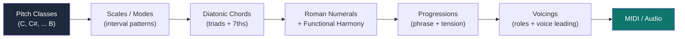
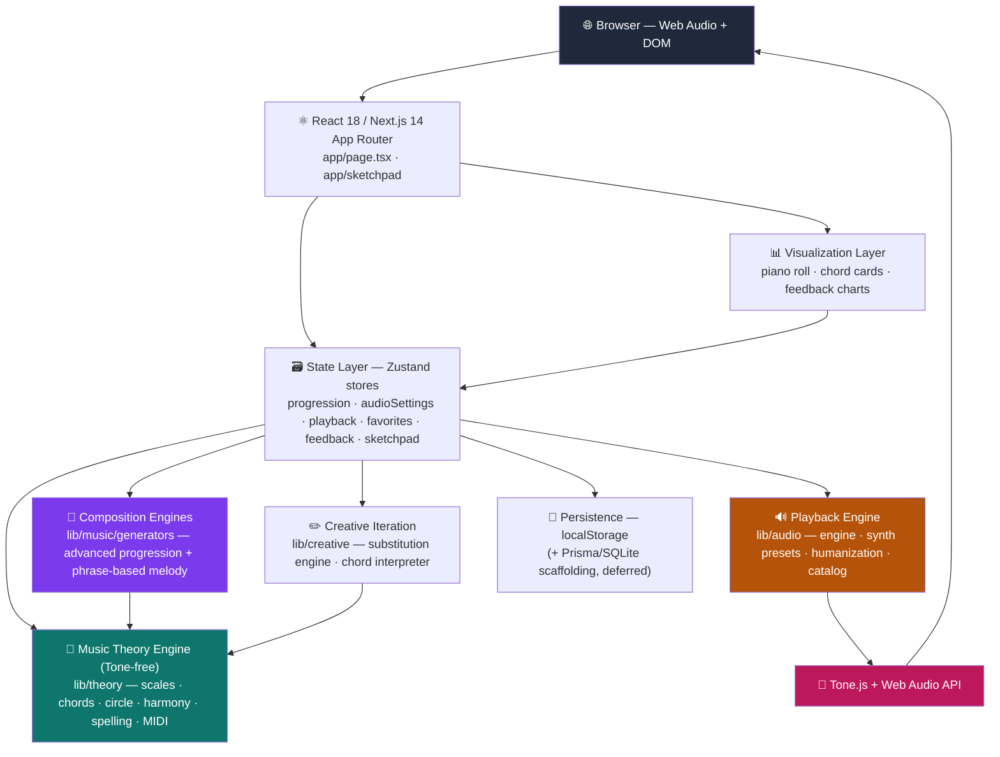
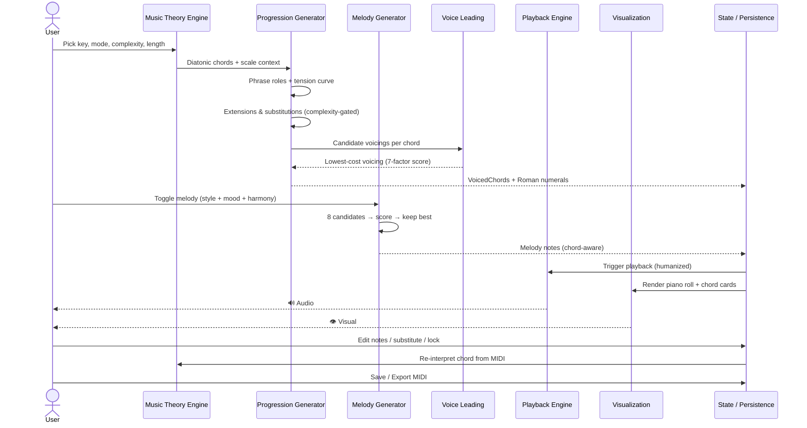
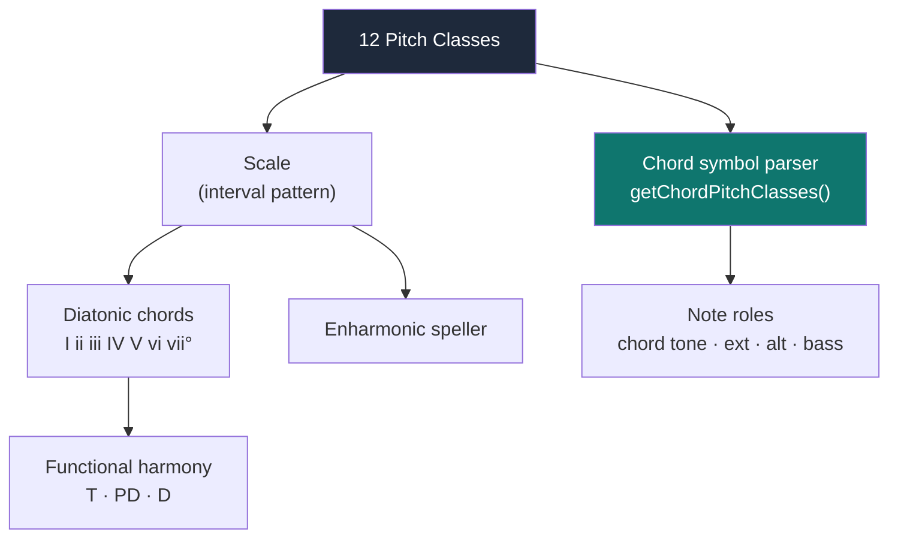
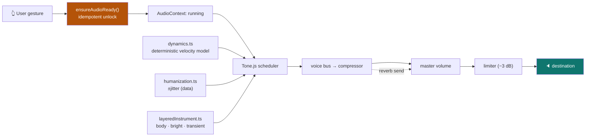

<div align="center">


# 🎹 Harmonia

### An interactive music composition platform for exploring harmony, chord progressions, melody generation, and music theory — entirely in the browser.

**Harmonia turns abstract music theory into something you can hear, see, edit, and reason about in real time.** It algorithmically generates musically coherent chord progressions and melodies, voices them with classical voice-leading rules, renders them through a multi-instrument Web Audio engine, and lets you refine every note with a theory-aware piano roll.

<br/>

<!-- Tech stack badges (static, always accurate) -->


<!-- Repo badges (dynamic, real) -->


[](#-license)

<!--
  TODO (maintainer): the following badges describe infrastructure that does NOT exist in the
  repo yet. Wire them up before enabling, so they reflect reality rather than decoration:
    • GitHub Actions CI    — add .github/workflows/ci.yml running `npm run lint && npm test`
    • Coverage             — publish `npm run test:coverage` output to Codecov/Coveralls
    • Release / version     — tag a release; `package.json` is currently 0.1.0 (private)
    • License              — add a LICENSE file, then swap the "TBD" badge above
-->

<br/>

[**Live Demo**](#) · [**Features**](#-core-features) · [**Architecture**](#-system-architecture) · [**Music Engine**](#-music-generation-engine) · [**Getting Started**](#-getting-started) · [**Roadmap**](#-roadmap)

<!-- TODO: replace [Live Demo](#) with the deployed Vercel URL (see VERCEL_SETUP.md). -->

<br/>


</div>

---

## ❓ The Problem

Musicians and producers learn music theory as a pile of disconnected facts — the circle of fifths in one book, voice leading in another, secondary dominants in a third — but the tools they use day-to-day rarely connect those concepts to **theory**, **visualization**, **experimentation**, and **playback** in a single place.

- A piano student understands what a `ii–V–I` *is*, but has no fast way to **hear** it in every key, mode, and voicing.
- A producer wants a starting progression with tasteful tensions, but a DAW gives them a blank piano roll, not **harmonic intent**.
- A learner can read that "tritone substitution shares two notes with the original dominant" — but can't **see those shared notes light up** and decide whether they like the result.

**Harmonia closes that loop.** Pick a key and mode, dial in complexity, and get a progression built from real harmonic rules — with Roman-numeral analysis, a synchronized piano roll, instant humanized playback, theory-justified substitutions, a phrase-aware melody generator, and one-click MIDI export. Every generated note is **explainable**, every edit is **theory-aware**, and every change is **immediately audible**.

---

## 🧠 Why This Project Is Technically Interesting

Harmonia is a deep dive into the hard parts of **computational music theory** and **interactive browser audio** — domains where naïve solutions sound obviously wrong to the ear. Each capability below was an engineering problem, not a library call.

| Capability | The Technical Challenge | How It's Engineered | Technologies |
|---|---|---|---|
| **Algorithmic progression generation** | Random diatonic chords sound aimless; real progressions have *direction*. | A phrase-structure model assigns each chord a role (opening → pre-dominant → dominant → cadence) along a per-length **tension curve**, then selects degrees to match. | TypeScript, seeded LCG RNG |
| **Voice-leading optimization** | Connecting chords smoothly is a combinatorial search; bad voice leading produces parallel fifths and ugly leaps. | A weighted **cost function** scores candidate voicings across 7 factors (smoothness, bass motion, common tones, parallel perfects, voice crossing, span, contrary motion) and minimizes it. | Custom search + heuristics |
| **Chord-symbol ↔ pitch-class engine** | The notes you *see* must always match the chord *label* across 12 roots × 6 scales × 25+ qualities. | A single source of truth (`getChordPitchClasses`) derives allowed pitch classes directly from the symbol; any voicing that drifts is logged and rebuilt safely. | Deterministic parser |
| **Phrase-based melody generation** | Note-by-note melodies wander; memorable melodies have form — a hook that returns, phrases that ask and answer, one climax. | Harmonic context per chord → a form plan of phrases with cadence degrees and a tension-placed climax → metrically weighted rhythm cells → a **beam search** per phrase over motif fidelity, melodic expectation and harmony → **8 candidates scored on 13 dimensions calibrated against 300k intervals of folk and pop melody**. | Mulberry32 PRNG, beam search, corpus statistics |
| **Real-time, glitch-free audio** | Mobile browsers start the audio context *suspended*; sample loads stall on flaky networks. | `ensureAudioReady()` unlocks from a real gesture (idempotent, never swallows errors); samplers **hot-swap** over a lightweight synth twin so playback never blocks or changes timbre family. | Tone.js, Web Audio API |
| **"Hand-played" humanization** | Quantized chords sound robotic. | A pure, dependency-free module applies per-note velocity (±12%) and timing jitter (±12 ms), with block / strum / arpeggio articulations — computed as data, not real-time. | Pure TS (testable) |
| **Theory-aware editing** | Letting users edit notes can break the chord identity. | A reverse chord interpreter re-derives the chord label from raw MIDI after every edit and tracks **provenance** (generated / substituted / manual). | Template matching |
| **Type-safe music domain model** | Music has rich, easy-to-misuse data (notes, intervals, roles, durations). | The whole domain is modeled in strict TypeScript — `Chord`, `VoicedChord`, note **roles** (chord tone / extension / alteration / bass), duration classes. | TypeScript |

<details>
<summary><b>⚡ Engineering Highlights — skim in 30 seconds</b></summary>

<br/>

> - 🎼 **Deterministic, seedable music generation** — same seed → same progression & melody, making the engine unit-testable (rare for generative audio).
> - 🧮 **Real algorithms, not lookup tables** — tension curves, weighted voice-leading cost minimization, a per-phrase melodic beam search, and melody scoring calibrated against the Essen Folksong Collection and the Rolling Stone 200.
> - 🔊 **Production-grade Web Audio** — gesture-unlock, lazy sampler streaming with seamless hot-swap, graceful degradation to synth on network failure, persisted quality modes.
> - 🎹 **Single source of truth for harmony** — `getChordPitchClasses` guarantees the notes you see and hear always match the chord label across all keys/modes/qualities.
> - 🧱 **Clean, layered architecture** — Tone-free theory core, Tone-free instrument catalog, pure humanization module, Zustand state — audio concerns never leak into music theory.
> - ✅ **~17K LOC of TypeScript, 20 test suites** covering theory correctness, generator consistency across keys, melody quality, and audio params.

</details>

---

## 🎯 Project Overview

### Why computational music theory is hard

Music theory is a system of **soft constraints, not hard rules**. A diminished passing chord is "correct" in one context and jarring in another; two voicings of the same chord can sound smooth or clumsy depending purely on the chord *before* it. There's no single right answer — only better and worse — and the ear is an unforgiving judge. Encoding that into deterministic code means modeling *taste* as cost functions and weighted heuristics, then validating the output against music-theoretic invariants.

### How Harmonia represents theory algorithmically



Everything is built up from **12 pitch classes**. Scales are interval patterns; chords are stacked scale degrees; progressions are sequences shaped by phrase structure and tension; voicings assign each note an octave, a role, and a position chosen to voice-lead smoothly from the previous chord.

### Why immediate feedback matters

Theory learned silently is theory half-learned. Harmonia plays **every** interaction — generate, click a chord card, tap a piano-roll note, preview a substitution — through the same unlocked audio engine. Seeing a tritone sub's shared notes light up *and hearing it resolve* in the same half-second is what turns a rule into intuition.

---

## ✨ Core Features

<table>
<tr>
<td width="50%" valign="top">

### 🎼 Chord Progression Generator
Generate coherent progressions in any key across **6 scales** (Major, Minor, Dorian, Mixolydian, Phrygian, **Major Pentatonic**) and **4 complexity levels** (Simple → Rich → Extended → Altered). Variable-duration chords, locking, and seeded reproducibility. Every progression resolves by default, or choose an **open ending** for half, deceptive and loop-friendly cadences. Four **moods** shape tension, register, density and harmonic rhythm, and each generation is the best of eight scored candidates. The voicing search resolves **tendency tones** — leading tones rise, chordal sevenths fall, suspensions resolve by step — as a soft cost weighed against smooth voice leading. Mood, ending, tension shape and brightness curve sit behind one collapsed **Character** row in the settings panel, so the everyday controls (key, mode, tempo, length, complexity, voicing) stay uncluttered.

</td>
<td width="50%" valign="top">

### 🎶 Phrase-Based Melody Generator
Melodies are composed as **form**, not as a line: the progression is cut into question-and-answer phrases, each with its own cadence degree, and the opening idea returns whole where the harmony returns. One highest note lands in the phrase the harmony makes tense, approached from below and left by step. Notes are chosen by a **beam search per phrase** that weighs the motif against melodic expectation, chord/colour/avoid categories, guide tones and tendency resolution. Chord changes are **approached** the way players get there — a step, a chromatic semitone from below, or an enclosure into a tone of the coming chord — and each phrase has a budget of **one surprise** (a leap of a sixth or wider, or an unresolved chromatic tone). **8 candidates scored on 13 corpus-calibrated dimensions**; one of the near-best is kept. Four moods (Dark, Emotional, Dreamy, Energetic) × three styles.

</td>
</tr>
<tr>
<td width="50%" valign="top">

### 🎹 Interactive Piano Roll
Click a note to preview & select, nudge it to the next in-key note with ▲/▼ or arrow keys, drag for free chromatic placement (desktop), double-click to add/remove. Chord labels re-interpret in real time.

</td>
<td width="50%" valign="top">

### 🔁 Theory-Guided Substitutions
Click any chord for theory-approved alternatives grouped by category — diatonic, relative, dominant-function, tritone, modal mixture, inversion — each with a plain-language reason and confidence score. Preview, then apply.

</td>
</tr>
<tr>
<td width="50%" valign="top">

### 🔊 Multi-Instrument Playback Engine
**Eight instruments** via Tone.js — Lush Piano, Electric Piano, Soft Keys, Filtered Saw, Organ, Warm Strings, Vibraphone, Pluck — each a velocity-sensitive **layered synth** (a body layer, a bright layer and a gated transient) so playing harder changes timbre, not just level. A master volume fader, a Dry/Room/Hall **space** control, and an independent **melody voice** (or follow the chords) sit alongside **Lightweight** (instant synth) and **High Quality** (streamed samples) modes that hot-swap seamlessly.

</td>
<td width="50%" valign="top">

### 🎚️ Humanized, Configurable Feel
A deterministic **dynamics model** shapes velocity by voice (top voice strongest, bass anchored), metric position and a progression-level tension swell, plus phrase-aware melody dynamics (crescendo to the climax, cadence taper) driven by its own **Melody level** control. Per-note timing variation (±12 ms) layers a hand-played feel on top. Tune Velocity, Melody level, Humanize, Sustain, and Soft Strum vs Block Chord — all settings persist across sessions.

</td>
</tr>
<tr>
<td width="50%" valign="top">

### 🧱 Harmonic Sketchpad
A song-level planner: multi-section structure (Intro/Verse/Chorus/Bridge/Drop/Outro), per-section key/scale for modulations, variant A/B/C comparison, full-song playback, and Roman-numeral analysis.

</td>
<td width="50%" valign="top">

### 💾 MIDI Export & Saved Progressions
Export chords, melody, or a combined **Chords + Melody** two-track MIDI file (`@tonejs/midi`) — same dynamics-model velocity curves, correct **GM program numbers** per instrument, and the melody track carries its own resolved voice when a separate one is chosen. Save favorites to a persistent list; reload or delete anytime.

</td>
</tr>
<tr>
<td width="50%" valign="top">

### 🎯 Validated Voicings + Roles
Every chord is checked against the chord-symbol source of truth; drifting voicings are rebuilt. Each note carries a **role** (chord tone / extension / alteration / bass).

</td>
<td width="50%" valign="top">

### 👍 Voicing Feedback Loop
Rate generated voicings thumbs-up/down; ratings persist and feed an approval-trend chart — the scaffolding for data-driven generator tuning.

</td>
</tr>
<tr>
<td width="50%" valign="top">

### 🎛️ MPE Expression Editor
Toggle the piano roll into **MPE Editor** mode to draw expressive pitch bends right on the grid — glides, scoops, pitch drops, and vibrato. **Join** two notes (or two equal-sized chords, auto-paired voice-by-voice) into an editable bend with one click. Reshape curves like vector graphics: drag handles, insert/delete points, smooth or straighten, reverse, scale amount/duration, copy/paste. Curves stay visible in normal mode and persist independently of playback for future MPE/MIDI export.

</td>
<td width="50%" valign="top">

<!-- reserved for the next feature card -->

</td>
</tr>
</table>

> Each feature is implemented in the layered architecture described below — see [Music Generation Engine](#-music-generation-engine), [Music Theory Engine](#-music-theory-engine), and [Audio Engine](#-audio-engine) for the algorithms behind them.

---

## 🏗️ System Architecture

Harmonia is a layered system: a **Tone-free music-theory core** at the bottom, generation engines on top of it, a Zustand state layer, and React/Tone.js at the surface. Audio concerns never leak downward into theory.



| Subsystem | Responsibility |
|---|---|
| **React / Next.js** | App Router pages (`app/page.tsx`, `app/sketchpad/page.tsx`), component tree, user interaction. |
| **State Layer (Zustand)** | Six stores hold progression, audio/playback settings, favorites, feedback, and sketchpad projects. Settings/favorites/feedback/sketchpad persist to `localStorage`; the live progression stays in-memory. |
| **Music Theory Engine** | Pure, Tone-free functions: scales, diatonic chords, circle of fifths, Roman numerals, enharmonic spelling, MIDI ↔ pitch class. The single source of truth for *what notes a chord contains*. |
| **Composition Engines** | The advanced progression generator and the phrase-based melody generator — both deterministic and seedable. |
| **Creative Iteration** | The substitution engine (theory-valid alternatives) and the chord interpreter (reverse-infers a chord label from edited MIDI). |
| **Playback Engine** | Gesture-unlock, instrument registry, humanization, lazy sampler loading with hot-swap and graceful fallback. |
| **Visualization Layer** | Synchronized piano roll, chord cards, melody lane, feedback chart. |
| **Persistence** | `localStorage` today; a Prisma + SQLite/Postgres schema exists under `prisma/` and `_deferred/` for the future learning-path backend. |

---

## 🔄 Composition Workflow

How a single "generate" flows through the system, from key selection to a saved composition:



| Stage | What happens |
|---|---|
| **1. Theory setup** | The engine builds the scale and diatonic chord set for the chosen key/mode. |
| **2. The spine** | Every chord slot gets a target tension from the chosen **tension shape** (phrase, arch, build, question, plateau, collapse), scaled by the mood; a target brightness from the **brightness curve** (steady, darkening, sunrise, lift, fade — or the mood's own); and a duration from the mood's harmonic-rhythm profile. |
| **3. Slot planning** | Each slot is filled against those targets: diatonic alternates within the functional family (tonic I/iii/vi, subdominant ii/IV, dominant V/vii°), plus at most **one borrowed chord per phrase** — modal interchange from a parallel mode, or a Neo-Riemannian transform of the previous chord — chosen by how closely its tension and brightness fit the slot. |
| **4. Extensions & subs** | Complexity level gates 7ths/9ths/13ths/alterations; secondary dominants, tritone subs, passing diminished, and suspensions are injected — then validated against a chromatic-density rule. |
| **5. Cadence** | The plan is capped to the requested length *first*, then the ending is set: `resolve` rewrites the final chord to the tonic (a minor key asked to end bright may close on a Picardy third), `open` keeps the plan's own ending. |
| **6. Bass line** | A small dynamic programme decides the bass note of every chord *before* voicing: root position at the opening, the cadence and the dominant that prepares it; first inversion where it buys a stepwise line; second inversion only as a cadential, passing or pedal 6-4; a seventh in the bass resolves down by step. Every chord carries its `bass` and `inversion`. |
| **7. Voice leading** | Candidates that honour the planned bass are connected by a bounded Viterbi (beam) search over the *whole* progression, not chord by chord. Each candidate is charged for its register (which rises with tension), its sensory roughness (Plomp-Levelt/Sethares), and the voice leading from the previous chord; a chord reached by a Neo-Riemannian transform adds its own parsimonious voicing. |
| **8. Scoring** | Steps 1-7 run eight times from derived seeds. Each finished progression is scored on cadence strength, bass motion, register arc, voice leading, variety, tension match (against the same formula the planner used) and mood fit including brightness, and the best is kept. |
| **9. Melody** | Optional: a melody is composed as phrases with question-and-answer cadences and one tension-placed climax, realized by a per-phrase beam search, and chosen from 8 corpus-scored candidates. It reads the chord engine's own tension curve, so melody and harmony peak together. |
| **10. Playback** | Notes are humanized and scheduled through Tone.js after the audio context is unlocked. |
| **11. Visualization** | Chord cards (with slash labels for inverted chords) and the piano roll render in sync, aligned by duration class. |
| **12. Editing** | Manual edits trigger reverse chord interpretation; provenance is tracked. |
| **13. Save** | Export MIDI or persist to favorites / the sketchpad. |

---

## 🧠 Music Generation Engine

> Source: `lib/music/generators/advanced/` (progressions) and `lib/music/generators/melody/` (melody).

### Progression pipeline


- **The tension spine** — Each chord is assigned one of 5 roles (`opening`, `continuation`, `pre-dominant`, `dominant`, `cadence`) and a target tension from a named **tension shape**: `phrase` (the classical arch, length 4 → `[0.1, 0.3, 0.8, 0.0]`), `arch`, `ramp`, `question` (antecedent to a half cadence, consequent to a full close), `plateau` (stillness, one surge) or `collapse` (open at maximum tension). Every chord's realised tension is a deterministic score — `0.40·function + 0.20·chromaticism + 0.15·dissonance + 0.10·inversion instability + 0.15·voice-leading distance` — and chords are chosen by distance to the target, so the curve shapes the harmony rather than merely gating its extensions.
- **Modal interchange** — A catalogue of borrowed chords is *derived* for the home mode: every chord diatonic to a parallel mode (lydian, ionian, mixolydian, dorian, aeolian, phrygian) but foreign to the home mode, tagged with the brightness of the nearest mode that contains it — iv, bVI, bIII and ii° from aeolian, bVII and v from mixolydian, the Neapolitan bII from phrygian, II and #iv° from lydian, the dorian IV in minor keys, and the harmonic-minor V and vii°7. A **brightness curve** (`steady`, `darkening`, `sunrise`, `arch`, `collapse`, or the mood's own) decides which are reached for; at most one is placed per phrase, so it reads as a surprise against a predictable context rather than as a dissolving key. A minor progression asked to end bright may close on a **Picardy third**.
- **Neo-Riemannian transforms** — `P L R S N H LP PL` on major/minor triads reach chromatic mediants and the hexatonic pole from the previous chord, and each transform *names* its voice leading: the voicer adds the parsimonious voicing (common tones held, the rest moved by the least possible) as a candidate.
- **Bass line** — Planned before voicing as a dynamic programme over the whole progression: root position at structural arrivals, first inversion for stepwise lines (a run of steps in one direction is rewarded), second inversion only as a cadential, passing or pedal 6-4, sevenths in the bass resolving down. Every chord carries `bass` and `inversion`, and the chord cards show inverted chords as slash chords (`C/E`).
- **Extensions** — Tension-gated: stable chords stay simple (≤ 7th); high-tension dominants receive 9ths, 13ths, and — at complexity 4 — altered tensions (`b9 #9 b5 #5 b13`).
- **Substitutions** — Secondary dominants (V/x), tritone substitutions, passing diminished, and suspensions are injected, with the first/last chords protected.
- **Chromatic-density validation** — A **2-of-3 rule** ensures that in any 4-chord window at least two chords remain diatonic; the least-important chromatic chord is dropped when violated.
- **Voicing** — Candidate voicings are generated across styles (closed, open, drop-2, drop-3, spread), octaves, and inversions. Tone selection always keeps root/3rd/7th; the 5th is dropped first when space is tight.
- **Voice leading** — Candidates honouring the planned bass are connected by a bounded **Viterbi (beam) search** over the whole progression, charging each candidate for register (rising with tension), **sensory roughness** (Plomp-Levelt, Sethares parameterisation, so low close voicings are heard as mud rather than caught by a rule) and the weighted voice-leading cost below.
- **Tendency-tone resolution** — The same voicing search (`advanced/tendencyTones.ts`) derives a chord identity per slot — root, function, dominant flag, the chordal seventh, and the chord it's expected to resolve to — and pays a soft transition cost when an upper voice leaves a tendency tone unresolved: the leading tone rises, the chordal seventh falls (or is held when the next chord contains it), the dominant tritone resolves in contrary motion, and suspensions fall by step; the bass stays the bass-line planner's responsibility. Optional `tendencyWeight` (default 2.0, `0` disables it); pentatonic is unaffected. Measured over 400 seeds: every voiceable leading tone now rises, seventh resolution rose from 60% to 77% at the defaults, suspensions from 73% to 91% at complexity 3, and mean voice motion per chord change *fell* (8.52 → 7.98 semitones) with generation time unchanged — see [`CHORD_PROGRESSION_ASSESSMENT.md`](CHORD_PROGRESSION_ASSESSMENT.md) §1a and `scripts/measureTendencyTones.ts`.
- **Major pentatonic** — Takes a dedicated planning path (`lib/theory/pentatonic.ts`), because the five-note scale breaks the assumptions every other stage makes. See below.

<details>
<summary><b>Why major pentatonic needs its own harmony</b></summary>

<br/>

Major pentatonic is the major scale with its two half-steps removed — `1 2 3 5 6`, so C major pentatonic is **C D E G A**. Dropping the 4th and 7th is what gives the scale its open, can't-sound-wrong character: there is no tritone and no leading tone anywhere in it.

That also means the familiar major-key chords aren't available. With no F and no B, **IV** (F A C), **V** (G B D) and **iii** (E G B) can't be built as ordinary triads, and "stack every other scale degree" — the recipe the rest of the engine runs on — assumes seven degrees, not five.

So the generator applies one rule instead: **every chord tone must be a note of the scale**. Working that through leaves exactly four usable chord roots:

| Degree | Root | Chords | Why |
|---|---|---|---|
| **I** | C | `C` · `C6` · `Cadd9` · `C6(9)` · `Csus2` | full major triad is in the scale |
| **II** | D | `Dsus4` · `D7sus4` · `Dsus2` · `D7sus2` | no F, so no 3rd → sus |
| *(III)* | E | — none — | needs B for any 3rd or 7th |
| **V** | G | `Gsus4` · `Gsus2` | no B, so no 3rd → sus |
| **vi** | A | `Am` · `Am7` · `Asus4` | full minor triad is in the scale |

The missing III is a property of the scale, not an oversight: E has no scale-mate a 3rd or 7th away, so it's used melodically but never as a chord root.

Two further consequences follow from having no leading tone:

- **The complexity dial adds scale tones, not chromatic tension** — 6ths, 9ths and sus 7ths (`C` → `C6` → `Cadd9` → `C6(9)`) instead of the altered dominants used elsewhere.
- **Chromatic substitutions are skipped** — secondary dominants, tritone subs and passing diminished each require a note the scale doesn't contain, which is exactly what a pentatonic setting is asking to avoid. The toggles stay in the UI for other scales; here they're inert.

The phrase machinery is unchanged, so progressions still open and cadence where a listener expects — they just lean on the I↔vi pull and use II/V as colour, the way a folk or gospel vamp does: `C6 – D7sus4 – Gsus2 – C6`, or `Am7 – D7sus4 – Gsus2 – C6`.

A test sweep asserts the guarantee directly: across all 12 keys, 4 complexity levels, and every seed and length, **no generated voicing ever contains a note outside the scale**.

</details>

<details>
<summary><b>Voice-leading cost function (7 weighted factors)</b></summary>

<br/>

| Factor | Weight | Goal |
|---|---|---|
| Voice-leading smoothness | 25% | Prefer stepwise motion, penalize large jumps |
| Bass motion | 20% | Reward stepwise / P4 / P5, penalize tritone leaps |
| Common-tone retention | 15% | Reward held tones between chords |
| Span penalty | 10% | Penalize voicings spanning > ~2.3 octaves |
| Parallel perfect intervals | 5% | Hard penalty for parallel 5ths / octaves |
| Voice crossing | 5% | Hard penalty for crossed voices |
| Contrary-motion bonus | −2 | Reward bass & soprano moving in opposite directions |

The voicing that minimizes total cost (relative to the previous chord) is selected. Generation is driven by a seeded 32-bit LCG, so a given seed reproduces the same progression exactly — which is what makes the generator unit-testable.

</details>

### Melody pipeline

```mermaid
flowchart LR
    HC["Harmonic context<br/>function · tension · categories"] --> FP["Form plan<br/>phrases · cadences · climax"]
    FP --> RH["Rhythm<br/>metric cells · breaths"]
    RH --> MO["Motifs<br/>state · restate · fragment"]
    MO --> AP["Approach plan<br/>step · chromatic · enclosure"]
    AP --> BS["Beam search<br/>expectation · harmony · surprise budget"]
    BS --> OR["Ornaments<br/>passing/neighbor/susp/antic/appog"]
    OR --> SC["Score 8 candidates<br/>→ keep one of the best"]
    style FP fill:#7c3aed,color:#fff
    style BS fill:#0f766e,color:#fff
```



Melodies are composed **top-down**, as form:

1. **Harmonic context** — every chord is read for its quality, scale degree, harmonic function and tension (the chord engine's own formula), then every one of the twelve pitch classes is classified over it as a **chord tone, colour tone, avoid tone or chromatic tone**. The avoid tone is the scale tone a semitone above a chord tone — the 4th over a major triad, the tonic over V7 — which is why the melody may sit on a 6th or a 9th but never leans on an avoid note. Tendency tones (the leading tone rising, a chordal 7th falling, 4̂→3̂, ♭6̂→5̂) and a **guide-tone line** through the changes are derived here too.
2. **Form plan** — the progression is cut into phrases on chord boundaries: one closed phrase for short forms, a **period** (question then answer) up to about six bars, then statement / restatement / departure / conclusion. A phrase **restates the opening idea where the chords return**, and each phrase gets a cadence type with a target degree — a half cadence on 2̂, 7̂ or 5̂, an imperfect close on 3̂ or 5̂, the final phrase on 1̂ approached by step. **One phrase is the climax**, chosen where the harmony is tense rather than by position, and only it may reach the top of the register.
3. **Rhythm** — a small vocabulary of one-bar cells, drawn by **metric weight** (downbeat > beat three > beats two and four > off-beats) and reused across phrases the way real songs do. Chord changes get an onset, sometimes anticipated by a half-beat; density tapers across each phrase; the cadence note is lengthened and a breath is carved before the next phrase's pickup.
4. **Motifs** — a basic idea is stated, restated with a new ending ("same head, different tail"), fragmented and sequenced in the departure, and liquidated into a stepwise close.
5. **Pitch realization** — a **beam search over each phrase**, not a greedy walk. Each candidate is charged for motif fidelity, melodic expectation (proximity, post-leap reversal, step inertia, regression to the mean), harmony by category and metric weight, the guide-tone line at chord changes, and tendency resolution — which, as classical practice requires, outranks the motif when a dissonance is owed a resolution. The phrase's peak and its cadence pitch are decided in advance so the line can aim for them. Once the rhythm is known, **approach figures** are planned into chord changes — a diatonic step, a chromatic semitone from below (a chromatic-category note that exists only because it resolves on the next onset) or an enclosure straddling the target, at mood- and style-dependent rates, never onto a peak or cadence note and never where the previous chord's own leading tone or seventh already resolves — and spent as bonuses in the same search. Each phrase also carries a **surprise budget**: one rare interval (a sixth or wider) or unresolved chromatic tone is free, a second costs, and fourths and fifths are rationed one tier down; the pinned climax's own leap consumes its phrase's budget. Measured on the analysis script's sample, approach figures at chord changes rose from 37% to 48%, phrases over budget fell from 11.5% to 0.9%, and leaps of a fourth or wider from 21% to 19% (the corpora sit at 12%) — see [`MELODY_ENGINE_ANALYSIS.md`](MELODY_ENGINE_ANALYSIS.md) §9.
6. **Ornaments** — passing tones, neighbor tones, suspensions, anticipations and appoggiaturas, mood-gated and tension-scaled, **always inserted with their resolution**, and never on the returning hook.
7. **Score & select** — **8 candidates** are scored on **13 dimensions** whose targets come from real melodies (interval mix, post-leap reversal, peak uniqueness and placement, cadence degrees, tendency resolution, breathing, rhythmic variety, range), and one of the near-best is kept so equal-quality candidates still vary with the seed.

**Moods** (`dark`, `emotional`, `dreamy`, `energetic`) parameterize register, span, rhythmic density, syncopation, rests, leap size, ornament palette and tension; **styles** (`lyrical`, `rhythmic`, `arpeggiated`) modulate the chosen mood. Determinism comes from a **mulberry32 PRNG** with derived independent sub-seeds.

<details>
<summary><b>Calibrated against real melodies — measured before and after</b></summary>

<br/>

The engine's targets are taken from the **Essen Folksong Collection** (6,059 songs, 293,595 intervals), the **CoCoPops Rolling Stone 200** pop/rock vocal melodies with chords (194 songs, 59,607 notes), **POP909**, **Nottingham** and **OpenEWLD**. Measured over 26,256 generated melodies before and after:

| Measure | Before | After | Real melodies |
|---|---|---|---|
| Times the highest note is reached | 3.5–3.8 | **1.0** | unique in 52–65% of phrases |
| Highest note arrives in bar 1 | 23–24% | **0%** | 24% |
| Longest run of one repeated pitch | 4.5 notes | **2.1** | mean run 1.3–1.4 |
| Melodies containing a 4-note drone | 48–62% | **0%** | — |
| Climax on a high-tension chord | 44% | **85%** | — |
| A breath at mid-phrase | 22–41% | **96–100%** | 41–81% of boundaries |
| Leading tones / 7ths resolving | 25% | **56%** | 37–44% (pop) |
| Leap followed by a reversal | 65–71% | **78–81%** | 74–90% |
| Sustained avoid tones per melody | 0.18 | **0.03** | — |
| Melodic range | 15.7–16.2 st | **13.2–13.8** | 12–19 per song |

The full analysis, including the trade-offs this cost, is in [`MELODY_ENGINE_ANALYSIS.md`](MELODY_ENGINE_ANALYSIS.md).

</details>

---

## 🎼 Music Theory Engine

> Source: `lib/theory/` — 13 Tone-free modules. This is the foundation everything else builds on.

| Concept | Module | Representation |
|---|---|---|
| **Notes / pitch classes** | `midiUtils.ts` | 12 canonical sharp-spelled pitch classes; MIDI ↔ pitch-class conversion. |
| **Intervals & scales** | `scale.ts` | Interval patterns (W-W-H-…) rotated from a root → 5 seven-note modes + major pentatonic. |
| **Chords** | `chord.ts`, `chordSymbol.ts` | Diatonic triads/7ths; `getChordPitchClasses` parses any symbol (25+ qualities) → pitch classes. |
| **Pentatonic harmony** | `pentatonic.ts` | Scale-safe chord vocabulary for major pentatonic, where stacked thirds don't apply. |
| **Roman numerals / function** | `harmonyEngine.ts`, `degreeInfo.ts` | Degree → numeral + harmonic function (tonic / subdominant / dominant). |
| **Circle of fifths** | `circle.ts` | 12-node geometry, relative major/minor, IV/V neighbors. |
| **Inversions** | `inversionLabel.ts` | Root / 1st / 2nd / 3rd / slash, inferred from the bass note. |
| **Extensions & alterations** | `chordSymbol.ts` | 7 / 9 / 11 / 13, `b9 #9 b5 #5`, sus, add. |
| **Enharmonic spelling** | `spelling.ts` | Key-aware respelling (A♯ → B♭ in F major). |
| **Voice leading** | `…/advanced/voiceLeading.ts`, `voicingSearch.ts` | Cost-based smooth connection, searched over the whole progression (see above). |
| **Bass line & inversions** | `…/advanced/bassLine.ts` | Plans the bass of every chord; `bass`/`inversion` travel with the chord. |
| **Borrowed harmony** | `…/advanced/modalInterchange.ts`, `neoRiemannian.ts` | Parallel-mode catalogue keyed to brightness; triadic transforms for chromatic mediants. |



**Single source of truth:** both voicings *and* the melody derive their notes from `getChordPitchClasses`. That's why the notes you see on the piano roll, the notes you hear, the melody, and the chord label can never disagree — there's exactly one function that decides what a chord contains.

<details>
<summary><b>Supported theory at a glance</b></summary>

<br/>

- **Scales (6):** Major, Natural Minor, Dorian, Mixolydian, Phrygian, Major Pentatonic (5-note)
- **Chord qualities (25+):** `maj`, `min`, `dim`, `aug`, `sus2`, `sus4`, `6`, `min6`, `7`, `maj7`, `min7`, `m7b5`, `dim7`, `9`, `maj9`, `min9`, `add9`, `7b9`, `7#9`, `7b5`, `7#5`, `7alt`, `7sus4`, `7sus2`, …
- **Substitution categories (6):** diatonic, relative, dominant-function, tritone, modal-mixture, inversion
- **Voicing styles (7):** auto, closed, open, drop-2, drop-3, drop-2+4, spread
- **Voice densities (3):** 3-voice (sparse), 4-voice (standard), 5-voice (rich)
- **Complexity levels (4):** Simple → Rich → Extended → Altered
- **Cadence modes (2):** resolve (always lands on the tonic; a Picardy third when a minor phrase ends bright), open (keeps half, deceptive and loop-friendly endings)
- **Chord moods (4):** dark, emotional, dreamy, energetic — each sets tension, register, density, harmonic rhythm, brightness curve and preferred ending
- **Tension shapes (6):** phrase, arch, ramp, question, plateau, collapse — the spine every chord is chosen against
- **Brightness curves (5 + auto):** steady, darkening, sunrise, arch, collapse
- **Borrowed chords (16 idioms, derived per mode):** iv, bVI, bIII, bII, II, #iv°, bVII, v, ii°, dorian IV, harmonic-minor V and vii°7, Picardy I, …
- **Neo-Riemannian transforms (8):** P, L, R, S, N, H, LP, PL
- **Harmonic rhythm profiles (4):** even, anchored, accelerating, pedal-opening
- **Inversions:** planned per chord (root, 1st, 2nd only as a 6-4 idiom, 3rd resolving down) and labelled as slash chords
- **Note roles (7):** chord tone, extension, alteration, passing, melody, approach, bass
- **Melodic note categories (4):** chord tone, colour tone, avoid tone, chromatic — derived per chord
- **Melodic cadences (3):** half (2̂/7̂/5̂), imperfect (3̂/5̂), authentic (1̂ approached by step)
- **Melodic forms (4):** single phrase, period, ternary, statement/restatement/departure/conclusion

</details>

---

## 🔊 Audio Engine

> Source: `lib/audio/` — engine, layered instruments, synth presets, instrument catalog, the deterministic dynamics model, humanization, master volume/space, and the `useInstrument` hook.

Harmonia's audio layer is built around three hard realities of browser audio: **contexts start suspended**, **samples are heavy**, and **quantized, one-level playback sounds robotic**.



- **Gesture unlock** — Every sound-producing interaction routes through `ensureAudioReady()`: it resumes the context from a real user gesture, is **idempotent** (concurrent callers share one unlock), waits until the context is actually `running`, and **never swallows failures**. A resume that never settles is abandoned after a bounded wait so the next tap gets a fresh attempt, and WebKit's `interrupted` state (a phone call, Siri, an app switch) is treated like `suspended`. An `AudioStatusBadge` surfaces the live state so silence is never a mystery.
- **iOS audio session** — Safari mutes Web-Audio-only pages with the ring/silent switch by default (the "ambient" category). The engine declares the session as media `playback`, the category a music app uses, so progressions sound with the switch in either position.
- **Layered instruments** — Every lightweight instrument is a `LayeredInstrument` (`layeredInstrument.ts`): one `triggerAttackRelease` fans out to a **body** layer (present at every dynamic), a **velocity-driven bright layer** (an expansive curve that blooms only when played hard) and a **gated transient** (hammer / tine click / key click / mallet / nail) — so velocity changes *timbre*, not just level. **Eight instruments** total — Lush Piano, Electric Piano, Soft Keys, Filtered Saw, Organ, Warm Strings, Vibraphone, Pluck — of which Piano and Electric Piano also have sampled High Quality realizations; melody realizations of each sit above the chord ones.
- **Signal chain** — Layers → per-instrument insert effects (chorus, tremolo, stereo widener) → a shared **voice bus** per instrument family → **compressor** → **master volume** → **limiter (−3 dB)** → destination, with a post-compressor **reverb send** per bus so the space control affects everything proportionally. Measured with the audition harness: instrument loudness spread at velocity 0.7 fell from ~14 dB to under 3 dB, and brightness rises with velocity on every instrument (piano: +123% spectral centroid across the velocity range).
- **Two quality modes** — *Lightweight* (pure Tone.js synthesis, zero downloads, instant, offline-friendly) and *High Quality* (sampled instruments). The sampler streams **in the background while the lightweight twin is already playing**, then **hot-swaps in seamlessly** — playback is never blocked by a download.
- **Graceful degradation** — If samples stall or fail (a 10s timeout, common on flaky mobile networks), playback keeps using the *lightweight twin of the same instrument* — a sampled piano degrades to a synth piano, not to an unrelated sound — and offers a Retry.
- **Master volume & space** — `audioSettingsStore` persists `masterVolume` (0–1) and `space` (`dry` / `room` / `hall`, controlling reverb decay, pre-delay and send level — see `lib/audio/audioSpace.ts`, Tone-free so the UI can import it directly), along with which instrument plays the **melody voice** (a specific instrument, or "follow chords"). A store subscription (`applyAudioSettings` in `synthPresets.ts`) ramps the live signal chain on every change — no instrument re-creation, no UI plumbing beyond calling the setters.
- **Dynamics model** — `dynamics.ts` is a pure, deterministic velocity model shared by the chord loop, previews, the Sketchpad and MIDI export, so a progression sounds — and exports — the same way everywhere:
  - **Voice weights** — the top voice reads strongest, the bass is anchored, inner voices sit back.
  - **Metric accent** — position within the bar shapes velocity (downbeat > beat 3 > beats 2 & 4 > off-beats).
  - **Progression-level shaping** — a first-chord lift, a last-chord settle, and a tension swell when a tension curve is available.
  - **Phrase-aware melody dynamics** — a crescendo into each phrase's peak, a louder climax phrase, a cadence taper, softer pickups, and a chord-tone-vs-non-chord-tone weighting.
  - It also fixed three bugs along the way: melody notes of 1.5/2.5/3/3.5 beats used to snap to a whole note (now exact); preview jitter could schedule a note in the past; strummed/arpeggiated voices now always end with their chord event.
- **Humanization** — Layered on top of the dynamics model, a pure, Tone-free, fully unit-tested module adds small per-note velocity (±12%) and timing jitter (±12 ms) as **data**, plus block / strum / arpeggio articulations. This is the *only* source of randomness in playback — velocity shaping itself stays deterministic in `dynamics.ts`.
- **Timing & latency** — Scheduling rides Tone.js's transport over the Web Audio clock; because humanization is pre-computed and the context is guaranteed `running` before any note fires, playback stays responsive and click-free (samplers ring out for 3 s before disposal on swap).
- **Instrument registry** — Instruments are described in layers: a **Tone-free catalog** (`instrumentCatalog.ts`, ids/labels/categories for UI), the **layered fan-out** (`layeredInstrument.ts`) and a **registry** (`synthPresets.ts`) mapping each to a lightweight `LayeredInstrument` and an optional `high` sampler. Adding an instrument is one catalog entry + one registry entry — playback code never changes.
- **Audition harness** — `npx tsx scripts/auditionInstruments.ts [--check] [--wav <dir>] [--json <file>] [--space dry|room|hall] [--volume 0..1] [--only <ids>]` offline-renders every instrument × role × velocity in headless Chromium and measures peak, RMS, spectral centroid, attack and tail length. `--check` fails the run on silence, `NaN`, clipping, a tail past 6 s, or loudness/brightness that doesn't rise with velocity on an instrument marked velocity-sensitive — sound changes are verified against it before they land.

> The acoustic piano uses the [Salamander Grand Piano](https://github.com/sfzinstruments/SalamanderGrandPiano) sample set by Alexander Holm (CC-BY 3.0), served via the Tone.js audio CDN.

---

## 📊 Visualization System

The UI keeps **what you see** locked to **what you hear** — chord cards and the piano roll are aligned by `durationClass` flex multipliers, and notes are color-coded by role (chord tones vs. melody).

| View | Component | Status |
|---|---|---|
| Progression generator + piano roll | `app/page.tsx`, `components/progression/` | ✅ Implemented (see hero screenshot) |
| Interactive piano roll editor | `components/creative/InteractivePianoRoll.tsx` | ✅ Implemented |
| Chord cards (symbol · numeral · notes · duration) | `components/progression/ChordCard.tsx` | ✅ Implemented |
| Melody lane | `components/creative/MelodyLane.tsx` | ✅ Implemented |
| Substitution panel | `components/creative/SubstitutionPanel.tsx` | ✅ Implemented |
| Voicing feedback + trend chart | `components/feedback/` | ✅ Implemented |
| Harmonic Sketchpad workspace | `components/sketchpad/` | ✅ Implemented |
| Audio status badge | `components/audio/AudioStatusBadge.tsx` | ✅ Implemented |

> 📸 **Asset TODO:** the repo currently ships a single hero screenshot (`public/screenshot.png`). To fully populate the [Screenshots](#-screenshots) gallery below, capture: Sketchpad workspace, Circle of Fifths, melody lane in action, dark mode, and the mobile layout. Animated GIFs of generation → playback would elevate it further (see [Recommended Assets](#-recommended-assets-to-elevate-the-repo)).

---

## 🗂️ Repository Structure

```
Harmonia/
├── app/                          # Next.js 14 App Router
│   ├── page.tsx                  #   Main generator + creative iteration UI
│   ├── sketchpad/page.tsx        #   Harmonic Sketchpad (song-level planner)
│   ├── layout.tsx                #   Root layout, metadata, PWA icons
│   └── globals.css               #   Tailwind base styles
│
├── lib/
│   ├── theory/                   # 🎼 Tone-free music theory core (14 modules)
│   │   ├── chordSymbol.ts         #   getChordPitchClasses — the single source of truth
│   │   ├── scale.ts · circle.ts   #   Scales/modes · circle of fifths
│   │   ├── pentatonic.ts          #   Scale-safe chord vocabulary for major pentatonic
│   │   ├── harmonyEngine.ts        #   Roman numerals + functional harmony
│   │   ├── spelling.ts · midiUtils.ts · inversionLabel.ts
│   │   └── progressionTypes.ts     #   Canonical `Chord` interface
│   │
│   ├── music/generators/
│   │   ├── advanced/              # 🧠 Progression engine
│   │   │   ├── phraseStructure.ts  #   Roles + the classical tension curve
│   │   │   ├── tensionCurve.ts     #   Tension shapes + per-chord tension formula (the spine)
│   │   │   ├── slotPlanner.ts      #   Fill each slot against the curves; one surprise per phrase
│   │   │   ├── modalInterchange.ts #   Borrowed-chord catalogue keyed to brightness; Picardy
│   │   │   ├── neoRiemannian.ts    #   P/L/R/S/N/H/LP/PL + parsimonious voice leading
│   │   │   ├── bassLine.ts         #   Bass-line planner (inversions as a DP)
│   │   │   ├── chordMoods.ts · progressionScore.ts
│   │   │   ├── extensions.ts · substitutions.ts
│   │   │   ├── voicing.ts · voiceLeading.ts · roughness.ts
│   │   │   ├── voicingSearch.ts    #   Bounded Viterbi over the whole progression
│   │   │   ├── tendencyTones.ts    #   Chord identity + tendency-tone resolution cost
│   │   │   └── generateAdvancedProgression.ts
│   │   └── melody/                # 🎶 Phrase-based melody engine
│   │       ├── harmonicContext.ts  #   Chord function, note categories, tendency tones
│   │       ├── phrasePlan.ts       #   Phrases, cadence degrees, the climax phrase
│   │       ├── meter.ts · rhythm.ts #   Metric weights · cells, breaths, density
│   │       ├── motif.ts · contour.ts · moods.ts · ornaments.ts
│   │       ├── realizePitches.ts   #   Per-phrase beam search
│   │       ├── scoring.ts · rng.ts · generateMelody.ts
│   │
│   ├── audio/                     # 🔊 Playback engine
│   │   ├── audioEngine.ts          #   ensureAudioReady() — gesture unlock
│   │   ├── synthPresets.ts         #   Instrument registry (synth + sampler)
│   │   ├── layeredInstrument.ts    #   Body/bright/transient velocity-layer fan-out
│   │   ├── instrumentCatalog.ts    #   Tone-free instrument metadata
│   │   ├── dynamics.ts             #   Deterministic velocity model (voices, accent, phrase arc)
│   │   ├── audioSpace.ts           #   Master volume + reverb space presets (Tone-free)
│   │   ├── humanization.ts         #   Pure velocity/timing variation
│   │   └── useInstrument.ts         #   Lazy load + hot-swap + fallback
│   │
│   ├── creative/                  # ✏️ Substitution engine + chord interpreter
│   ├── expression/               # 🎛️ MPE expression model (types · presets · curve ops)
│   ├── sketchpad/                 # 🧱 Song-planner store + types
│   ├── state/                     # 🗃️ Zustand stores (progression, audio, playback)
│   ├── favorites/ · feedback/     #   Persisted favorites & voicing feedback
│   └── progressionMidiExport.ts   # 💾 MIDI export via @tonejs/midi
│
├── components/                    # ⚛️ React components
│   ├── piano-roll/ · progression/ #   Piano rolls & chord cards
│   ├── creative/                  #   Interactive roll · substitution panel · melody lane · MPE toolbar + expression overlay
│   ├── sketchpad/                 #   Workspace · structure · section editor
│   ├── feedback/ · audio/         #   Feedback chart · audio status badge
│
├── scripts/                       # 🔬 Offline measurement & audit harnesses
│   ├── auditionInstruments.ts      #   Headless-Chromium instrument audition (--check)
│   └── measureTendencyTones.ts     #   Before/after tendency-tone resolution rates
│
├── prisma/                        # 💤 SQLite/Postgres schema (deferred learning-path backend)
├── _deferred/                     # 💤 Archived v2 features (flashcards, SRS, API routes)
├── public/                        # Icons, manifest, screenshot
└── docs (root *.md)               # Engineering audits & analyses (see Documentation)
```

---

## 📈 Engineering Metrics

> Measured from the repository (`app/ + components/ + lib/`, excluding tests). Coverage % is not yet published — see the badge TODO.

| Metric | Value |
|---|---|
| **Lines of TypeScript/TSX** (app + components + lib, excl. tests) | ~17,400 |
| **TypeScript source files** | 99 |
| **React components** | 16 |
| **Music theory modules** (`lib/theory/`) | 13 |
| **Composition engines** | 2 (advanced progression + phrase-based melody) |
| **Zustand state stores** | 6 |
| **Audio engine modules** (`lib/audio/`) | 9 |
| **Test suites** (active, Vitest) | 46 (1,038 tests; 3 pre-existing `_deferred/` suites fail to import) |
| **Test LOC** | ~2,100 |
| **Supported scales / modes** | 6 |
| **Supported chord qualities** | 25+ |
| **Progression complexity levels** | 4 |
| **Substitution categories** | 6 |
| **Voicing styles × densities** | 6 × 3 |
| **Melody moods × styles** | 4 × 3 |
| **Melody candidates scored per request** | 8 (on 13 corpus-calibrated dimensions) |
| **Instruments (synth / sampled)** | 8 (2 sampled) |
| **Test coverage %** | _TODO — run `npm run test:coverage` and publish_ |
| **Avg. generation latency** | _TODO — add a micro-benchmark; generation is synchronous & seedable_ |

---

## 🚀 Getting Started

### Prerequisites
- **Node.js** 18+ and **npm**

### Install & run

```bash
git clone https://github.com/TGALLOWAY1/Harmonia.git
cd Harmonia
npm install
npm run dev
```

Open **[http://localhost:3000](http://localhost:3000)** for the progression generator, or **[http://localhost:3000/sketchpad](http://localhost:3000/sketchpad)** for the Harmonic Sketchpad.

### Common commands

| Command | What it does |
|---|---|
| `npm run dev` | Start the dev server (hot reload) |
| `npm run build` | Production build |
| `npm start` | Serve the production build |
| `npm run lint` | Run ESLint (`eslint-config-next`) |
| `npm test` | Run the Vitest suite once |
| `npm run test:watch` | Vitest in watch mode |
| `npm run test:coverage` | Run tests with V8 coverage |

### Generating your first composition
1. Pick a **key** and **mode**, set **complexity** and chord count.
2. Click **Generate** for a progression; **Play** to loop it.
3. Inspect voicings in the piano roll — click a note, nudge with **▲/▼** or arrow keys.
4. **Lock** chords you like, regenerate to replace only the rest.
5. Click **Melody** (choose style + mood + harmony) to add a melody line.
6. **Substitute** any chord for theory-guided alternatives.
7. **Save** to favorites or **Export MIDI** for your DAW.

### Deploying
Harmonia is a standard Next.js app and deploys cleanly to **Vercel** — see [`VERCEL_SETUP.md`](VERCEL_SETUP.md). The `localStorage`-backed app needs no database; the Prisma `vercel-build` step is only relevant if/when the deferred backend is enabled.

---

## 🖼️ Screenshots

<div align="center">

**Progression Builder + Synchronized Piano Roll**


</div>

> 📸 **Gallery TODO** — the following slots are intentionally left as placeholders until assets are captured. Add images under `public/` (or GitHub asset uploads) and link them here:
>
> | Section | Suggested capture |
> |---|---|
> | Melody Editor | Melody lane overlaid on the piano roll with amber notes |
> | Harmonic Sketchpad | Multi-section song with variants |
> | Circle of Fifths | Interactive key-relationship view |
> | Substitution Panel | Theory-grouped alternatives with reasons |
> | Dark Mode | Same generator in dark theme |
> | Mobile | Compact action bar + chord cards |

---

## 🧩 Design Decisions

<details>
<summary><b>Why React + Next.js 14 (App Router)?</b></summary>

Music UIs are deeply interactive and state-driven — React's component model fits the piano roll, chord cards, and live editing naturally. Next.js gives a batteries-included build, file-based routing for the two surfaces (generator + sketchpad), PWA metadata/icons, and a frictionless Vercel deploy. The App Router keeps the two pages cleanly separated.

</details>

<details>
<summary><b>Why TypeScript?</b></summary>

Music is a domain of rich, easy-to-misuse data. Modeling `Chord`, `VoicedChord`, note **roles**, **duration classes**, and **provenance** as strict types makes whole classes of bugs impossible (e.g. passing a melody note where a chord tone is expected) and turns the theory engine into self-documenting code.

</details>

<details>
<summary><b>Why Tone.js + a browser audio engine?</b></summary>

A browser-native engine means **zero install** — share a URL and the user is making music. Tone.js abstracts Web Audio scheduling, synthesis, and sampling while leaving low-level control where needed. The tradeoffs (suspended contexts, sample weight, latency) are real, which is exactly why the audio layer invests in gesture-unlock, hot-swap loading, and pre-computed humanization.

</details>

<details>
<summary><b>Why this music-theory representation?</b></summary>

A **single source of truth** (`getChordPitchClasses`) deriving pitch classes from the chord symbol guarantees that labels, voicings, the melody, and the piano roll can never disagree. Internally, pitch classes are sharp-spelled for unambiguous MIDI math, with a **separate enharmonic spelling layer** for human-readable notation — keeping computation and presentation cleanly decoupled.

</details>

<details>
<summary><b>Why Zustand + localStorage (and deferred Prisma)?</b></summary>

The app is client-first: settings, favorites, feedback, and sketches live in `localStorage` for an instant, account-free experience. Zustand provides minimal-boilerplate stores with persist middleware. A Prisma + SQLite/Postgres schema already exists for the **v2 learning-path backend** (flashcards, spaced repetition) but is intentionally deferred so the current product stays lightweight.

</details>

<details>
<summary><b>Why deterministic, seeded generation?</b></summary>

Generative audio is notoriously hard to test. By driving generation with seeded PRNGs (LCG for progressions, mulberry32 for melody), the same seed always produces the same output — which makes the engines **unit-testable**, reproducible for users, and debuggable.

</details>

---

## 🗺️ Roadmap

| Stage | Items |
|---|---|
| **✅ Current** | Progression generator with tendency-tone voice leading, phrase-based melody, interactive piano roll, theory-guided substitutions, velocity-layered multi-instrument playback with hot-swap, a deterministic dynamics/humanization model, MIDI export (chords, melody, or combined), favorites, voicing feedback, Harmonic Sketchpad |
| **🔜 Next** | **Melody-first harmonization** — draw a melody in a scale-snapped roll, then auto-harmonize with smooth functional motion (prototyped, reverted pending better chord-fit scoring — see roadmap notes). MIDI **import**. **Self-hosted / better sample sets** for the High Quality tier — mirror the samples instead of depending on a third-party CDN, and improve Electric Piano's. **Per-instrument CPU budget** on low-end mobile — the layered instruments add voices per note; profile and cap polyphony on constrained devices. Expanded screenshot/GIF gallery. CI + coverage badges. |
| **🧪 v2 — Learning Path** | Flashcards, spaced repetition (SRS), circle-of-fifths exercises, milestone curriculum. Schema, card templates, and SRS engine already scaffolded under `_deferred/` and `prisma/`. |
| **🎶 Melody next** | A sixteenth-note grid for pop styles (47% of POP909 note durations are sixteenths), and closing the remaining interval gap to the corpora (mean interval 2.73 vs 2.15) without reintroducing drones. Escape tones and the cambiata are deliberately off the list: both leave a non-chord tone by leap, which the engine's step-resolution guarantee forbids. |
| **🔭 Research ideas** | AI-assisted composition, style transfer, genre-specific generators, counterpoint generation, adaptive harmonization, voice-leading optimization (search → learned), notation editor, DAW integration, collaboration, live-performance mode |

---

## 📚 Documentation

The repository includes several in-depth engineering documents that double as design rationale:

| Doc | Contents |
|---|---|
| [`CLAUDE.md`](CLAUDE.md) | Project overview, architecture, conventions |
| [`CHORD_ENGINE_AUDIT.md`](CHORD_ENGINE_AUDIT.md) | Deep audit of the chord/voicing engine |
| [`CHORD_PROGRESSION_ASSESSMENT.md`](CHORD_PROGRESSION_ASSESSMENT.md) | Emotional flow & voicing assessment, with research-backed roadmap |
| [`AUDIO_ENGINE_ASSESSMENT.md`](AUDIO_ENGINE_ASSESSMENT.md) | Audio architecture & resilience assessment |
| [`MELODY_ENGINE_ANALYSIS.md`](MELODY_ENGINE_ANALYSIS.md) | Before/after audit of the melody engine |
| [`MOBILE_UX_AUDIT.md`](MOBILE_UX_AUDIT.md) · [`MOBILE_IMPLEMENTATION_PLAN.md`](MOBILE_IMPLEMENTATION_PLAN.md) | Mobile UX audit & plan |
| [`VERCEL_SETUP.md`](VERCEL_SETUP.md) | Deployment guide |
| [`DIAGNOSTICS.md`](DIAGNOSTICS.md) | Audio debugging notes |

> 📝 **Docs TODO:** consider promoting the highlights of these into a `docs/` folder with dedicated pages for *Architecture*, *Music Theory Engine*, *Audio Engine*, *Contributing*, and *Troubleshooting*.

---

## 🤝 Contributing

Contributions are welcome — whether you're an engineer, an audio/DSP person, or a musician with theory expertise.

**Development workflow**
1. Fork and branch from `main` (`feat/…`, `fix/…`).
2. `npm install`, then develop with `npm run dev`.
3. Keep changes type-safe and run `npm run lint` + `npm test` before pushing.
4. Open a PR with a clear description and, for UI changes, before/after screenshots or a GIF.

**Coding standards**
- TypeScript-strict; model new music concepts as explicit types.
- Keep the **theory core Tone-free** — no audio imports in `lib/theory/`.
- All chord notes must flow through `getChordPitchClasses` (the single source of truth).
- Mutations go through Zustand store actions, not direct state edits.
- Prefer **deterministic, seeded** logic over raw randomness so behavior stays testable.

**Testing expectations**
- Add Vitest tests for new theory/generation logic (see `lib/**/__tests__/`).
- For generation changes, include a cross-key or quality-coverage test where practical.

**Music-theory contributions**
- Cite the theory rule you're encoding (e.g. a specific voice-leading or substitution principle) in the PR so reviewers can verify musical correctness, not just code correctness.

> 📝 **TODO:** add `CONTRIBUTING.md`, issue/PR templates under `.github/`, and a `CODE_OF_CONDUCT.md`.

---

## 🎁 Recommended Assets to Elevate the Repo

To take this from "great README" to "portfolio centerpiece," consider adding:

- 🎞️ **Animated composition demo** — generate → play → tweak, as a looping GIF in the hero.
- 🎹 **Piano-roll walkthrough GIF** — selecting a note and nudging it in-key.
- 🔊 **Playback GIFs** — lightweight vs. high-quality sampler hot-swap.
- 🌀 **Interactive Circle of Fifths illustration** — key relationships lighting up.
- 📈 **Music-generation benchmarks** — generation latency & determinism proof.
- 🏛️ **Polished architecture graphic** — a designed version of the Mermaid diagrams above.
- 🆚 **Feature-comparison table** — Harmonia vs. typical DAW chord tools / theory apps.
- 🎵 **Example compositions / MIDI demos** — exported `.mid` files + audio renders.
- 🎬 **A 60–90s demo video** — the single highest-impact asset for recruiters.

---

## 📄 License

> ⚠️ **TODO:** No `LICENSE` file is present in the repository yet. Add one (e.g. **MIT** for an open portfolio project) and update the License badge at the top. Until then, all rights are reserved by the author.

---

<div align="center">

**Harmonia** — computational music theory you can hear.

<sub>Built with Next.js · TypeScript · Tone.js · Zustand · Tailwind CSS</sub>

</div>
