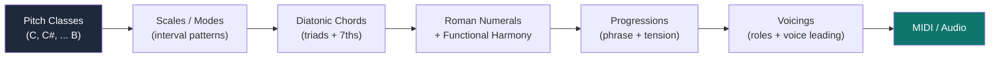
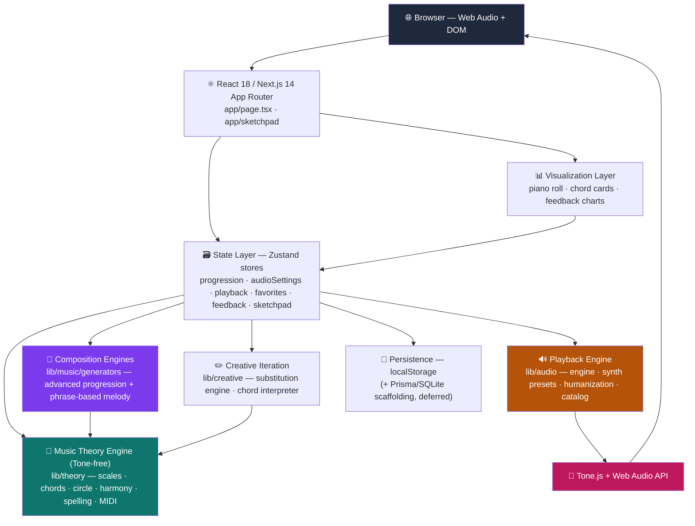
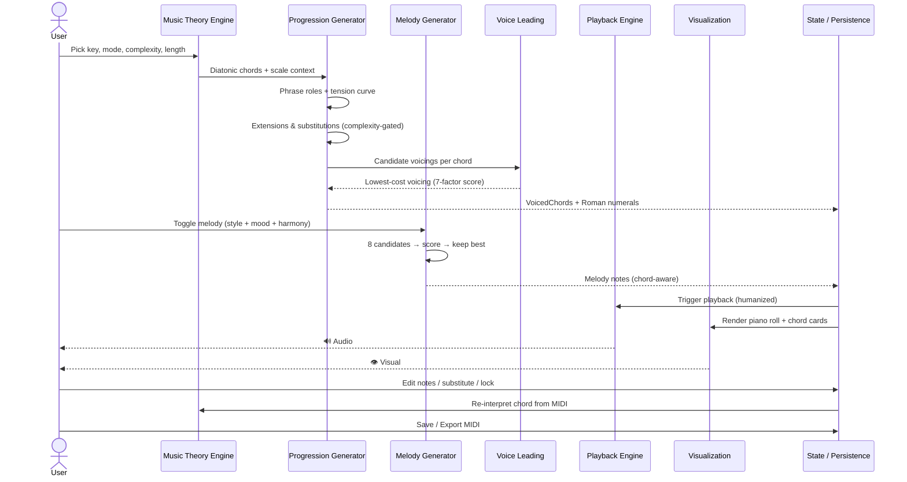
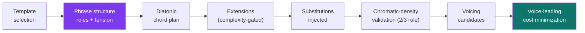
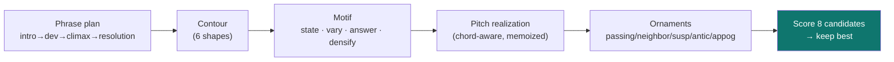
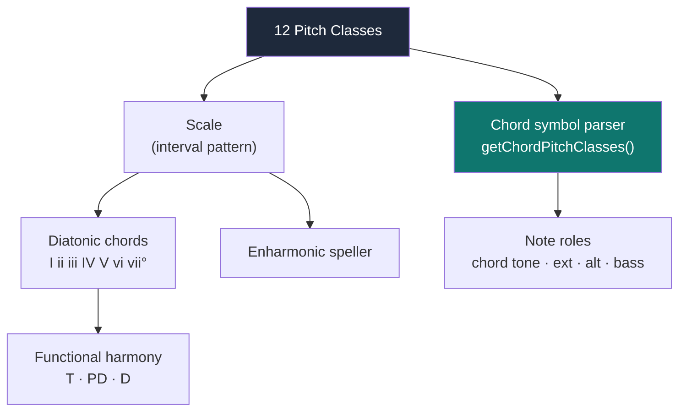
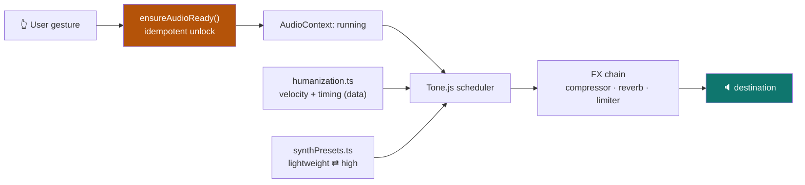

<div align="center">


# 🎹 Harmonia

### An interactive music composition platform for exploring harmony, chord progressions, melody generation, and music theory — entirely in the browser.

**Harmonia turns abstract music theory into something you can hear, see, edit, and reason about in real time.** It algorithmically generates musically coherent chord progressions and melodies, voices them with classical voice-leading rules, renders them through a multi-instrument Web Audio engine, and lets you refine every note with a theory-aware piano roll.

<br/>

<!-- Tech stack badges (static, always accurate) -->


<!-- Repo badges (dynamic, real) -->


[](#-license)

<!--
  TODO (maintainer): the following badges describe infrastructure that does NOT exist in the
  repo yet. Wire them up before enabling, so they reflect reality rather than decoration:
    • GitHub Actions CI    — add .github/workflows/ci.yml running `npm run lint && npm test`
    • Coverage             — publish `npm run test:coverage` output to Codecov/Coveralls
    • Release / version     — tag a release; `package.json` is currently 0.1.0 (private)
    • License              — add a LICENSE file, then swap the "TBD" badge above
-->

<br/>

[**Live Demo**](#) · [**Features**](#-core-features) · [**Architecture**](#-system-architecture) · [**Music Engine**](#-music-generation-engine) · [**Getting Started**](#-getting-started) · [**Roadmap**](#-roadmap)

<!-- TODO: replace [Live Demo](#) with the deployed Vercel URL (see VERCEL_SETUP.md). -->

<br/>


</div>

---

## ❓ The Problem

Musicians and producers learn music theory as a pile of disconnected facts — the circle of fifths in one book, voice leading in another, secondary dominants in a third — but the tools they use day-to-day rarely connect those concepts to **theory**, **visualization**, **experimentation**, and **playback** in a single place.

- A piano student understands what a `ii–V–I` *is*, but has no fast way to **hear** it in every key, mode, and voicing.
- A producer wants a starting progression with tasteful tensions, but a DAW gives them a blank piano roll, not **harmonic intent**.
- A learner can read that "tritone substitution shares two notes with the original dominant" — but can't **see those shared notes light up** and decide whether they like the result.

**Harmonia closes that loop.** Pick a key and mode, dial in complexity, and get a progression built from real harmonic rules — with Roman-numeral analysis, a synchronized piano roll, instant humanized playback, theory-justified substitutions, a phrase-aware melody generator, and one-click MIDI export. Every generated note is **explainable**, every edit is **theory-aware**, and every change is **immediately audible**.

---

## 🧠 Why This Project Is Technically Interesting

Harmonia is a deep dive into the hard parts of **computational music theory** and **interactive browser audio** — domains where naïve solutions sound obviously wrong to the ear. Each capability below was an engineering problem, not a library call.

| Capability | The Technical Challenge | How It's Engineered | Technologies |
|---|---|---|---|
| **Algorithmic progression generation** | Random diatonic chords sound aimless; real progressions have *direction*. | A phrase-structure model assigns each chord a role (opening → pre-dominant → dominant → cadence) along a per-length **tension curve**, then selects degrees to match. | TypeScript, seeded LCG RNG |
| **Voice-leading optimization** | Connecting chords smoothly is a combinatorial search; bad voice leading produces parallel fifths and ugly leaps. | A weighted **cost function** scores candidate voicings across 7 factors (smoothness, bass motion, common tones, parallel perfects, voice crossing, span, contrary motion) and minimizes it. | Custom search + heuristics |
| **Chord-symbol ↔ pitch-class engine** | The notes you *see* must always match the chord *label* across 12 roots × 5 modes × 25+ qualities. | A single source of truth (`getChordPitchClasses`) derives allowed pitch classes directly from the symbol; any voicing that drifts is logged and rebuilt safely. | Deterministic parser |
| **Phrase-based melody generation** | Note-by-note melodies wander; catchy melodies have motifs, contour, and call-and-response. | A top-down pipeline: phrase plan → contour → motif → state/vary/answer/densify → resolve, then **8 candidates scored on 8 catchiness dimensions** and the best kept. | Mulberry32 PRNG, Pearson correlation |
| **Real-time, glitch-free audio** | Mobile browsers start the audio context *suspended*; sample loads stall on flaky networks. | `ensureAudioReady()` unlocks from a real gesture (idempotent, never swallows errors); samplers **hot-swap** over a lightweight synth twin so playback never blocks or changes timbre family. | Tone.js, Web Audio API |
| **"Hand-played" humanization** | Quantized chords sound robotic. | A pure, dependency-free module applies per-note velocity (±12%) and timing jitter (±12 ms), with block / strum / arpeggio articulations — computed as data, not real-time. | Pure TS (testable) |
| **Theory-aware editing** | Letting users edit notes can break the chord identity. | A reverse chord interpreter re-derives the chord label from raw MIDI after every edit and tracks **provenance** (generated / substituted / manual). | Template matching |
| **Type-safe music domain model** | Music has rich, easy-to-misuse data (notes, intervals, roles, durations). | The whole domain is modeled in strict TypeScript — `Chord`, `VoicedChord`, note **roles** (chord tone / extension / alteration / bass), duration classes. | TypeScript |

<details>
<summary><b>⚡ Engineering Highlights — skim in 30 seconds</b></summary>

<br/>

> - 🎼 **Deterministic, seedable music generation** — same seed → same progression & melody, making the engine unit-testable (rare for generative audio).
> - 🧮 **Real algorithms, not lookup tables** — tension curves, weighted voice-leading cost minimization, 8-candidate melody scoring with Pearson contour correlation.
> - 🔊 **Production-grade Web Audio** — gesture-unlock, lazy sampler streaming with seamless hot-swap, graceful degradation to synth on network failure, persisted quality modes.
> - 🎹 **Single source of truth for harmony** — `getChordPitchClasses` guarantees the notes you see and hear always match the chord label across all keys/modes/qualities.
> - 🧱 **Clean, layered architecture** — Tone-free theory core, Tone-free instrument catalog, pure humanization module, Zustand state — audio concerns never leak into music theory.
> - ✅ **~17K LOC of TypeScript, 20 test suites** covering theory correctness, generator consistency across keys, melody quality, and audio params.

</details>

---

## 🎯 Project Overview

### Why computational music theory is hard

Music theory is a system of **soft constraints, not hard rules**. A diminished passing chord is "correct" in one context and jarring in another; two voicings of the same chord can sound smooth or clumsy depending purely on the chord *before* it. There's no single right answer — only better and worse — and the ear is an unforgiving judge. Encoding that into deterministic code means modeling *taste* as cost functions and weighted heuristics, then validating the output against music-theoretic invariants.

### How Harmonia represents theory algorithmically



Everything is built up from **12 pitch classes**. Scales are interval patterns; chords are stacked scale degrees; progressions are sequences shaped by phrase structure and tension; voicings assign each note an octave, a role, and a position chosen to voice-lead smoothly from the previous chord.

### Why immediate feedback matters

Theory learned silently is theory half-learned. Harmonia plays **every** interaction — generate, click a chord card, tap a piano-roll note, preview a substitution — through the same unlocked audio engine. Seeing a tritone sub's shared notes light up *and hearing it resolve* in the same half-second is what turns a rule into intuition.

---

## ✨ Core Features

<table>
<tr>
<td width="50%" valign="top">

### 🎼 Chord Progression Generator
Generate coherent progressions in any key across **5 modes** (Major, Minor, Dorian, Mixolydian, Phrygian) and **4 complexity levels** (Simple → Rich → Extended → Altered). Variable-duration chords, locking, and seeded reproducibility.

</td>
<td width="50%" valign="top">

### 🎶 Phrase-Based Melody Generator
Top-down melody composition: phrase plan → contour → motif → variation → resolution. **8 candidates scored on 8 catchiness dimensions**; the best is kept. Four moods (Dark, Emotional, Dreamy, Energetic) × three styles.

</td>
</tr>
<tr>
<td width="50%" valign="top">

### 🎹 Interactive Piano Roll
Click a note to preview & select, nudge it to the next in-key note with ▲/▼ or arrow keys, drag for free chromatic placement (desktop), double-click to add/remove. Chord labels re-interpret in real time.

</td>
<td width="50%" valign="top">

### 🔁 Theory-Guided Substitutions
Click any chord for theory-approved alternatives grouped by category — diatonic, relative, dominant-function, tritone, modal mixture, inversion — each with a plain-language reason and confidence score. Preview, then apply.

</td>
</tr>
<tr>
<td width="50%" valign="top">

### 🔊 Multi-Instrument Playback Engine
Five instruments via Tone.js — Lush Piano, Electric Piano, Soft Keys, Filtered Saw, Organ — with **Lightweight** (instant synth) and **High Quality** (streamed samples) modes that hot-swap seamlessly.

</td>
<td width="50%" valign="top">

### 🎚️ Humanized, Configurable Feel
Per-note velocity & timing variation (±12 ms) for a hand-played feel. Tune Velocity, Humanize, Sustain, and Soft Strum vs Block Chord. All settings persist across sessions.

</td>
</tr>
<tr>
<td width="50%" valign="top">

### 🧱 Harmonic Sketchpad
A song-level planner: multi-section structure (Intro/Verse/Chorus/Bridge/Drop/Outro), per-section key/scale for modulations, variant A/B/C comparison, full-song playback, and Roman-numeral analysis.

</td>
<td width="50%" valign="top">

### 💾 MIDI Export & Saved Progressions
Export chords or melody as a standard MIDI file (`@tonejs/midi`) with musical velocity curves. Save favorites to a persistent list; reload or delete anytime.

</td>
</tr>
<tr>
<td width="50%" valign="top">

### 🎯 Validated Voicings + Roles
Every chord is checked against the chord-symbol source of truth; drifting voicings are rebuilt. Each note carries a **role** (chord tone / extension / alteration / bass).

</td>
<td width="50%" valign="top">

### 👍 Voicing Feedback Loop
Rate generated voicings thumbs-up/down; ratings persist and feed an approval-trend chart — the scaffolding for data-driven generator tuning.

</td>
</tr>
</table>

> Each feature is implemented in the layered architecture described below — see [Music Generation Engine](#-music-generation-engine), [Music Theory Engine](#-music-theory-engine), and [Audio Engine](#-audio-engine) for the algorithms behind them.

---

## 🏗️ System Architecture

Harmonia is a layered system: a **Tone-free music-theory core** at the bottom, generation engines on top of it, a Zustand state layer, and React/Tone.js at the surface. Audio concerns never leak downward into theory.



| Subsystem | Responsibility |
|---|---|
| **React / Next.js** | App Router pages (`app/page.tsx`, `app/sketchpad/page.tsx`), component tree, user interaction. |
| **State Layer (Zustand)** | Six stores hold progression, audio/playback settings, favorites, feedback, and sketchpad projects. Settings/favorites/feedback/sketchpad persist to `localStorage`; the live progression stays in-memory. |
| **Music Theory Engine** | Pure, Tone-free functions: scales, diatonic chords, circle of fifths, Roman numerals, enharmonic spelling, MIDI ↔ pitch class. The single source of truth for *what notes a chord contains*. |
| **Composition Engines** | The advanced progression generator and the phrase-based melody generator — both deterministic and seedable. |
| **Creative Iteration** | The substitution engine (theory-valid alternatives) and the chord interpreter (reverse-infers a chord label from edited MIDI). |
| **Playback Engine** | Gesture-unlock, instrument registry, humanization, lazy sampler loading with hot-swap and graceful fallback. |
| **Visualization Layer** | Synchronized piano roll, chord cards, melody lane, feedback chart. |
| **Persistence** | `localStorage` today; a Prisma + SQLite/Postgres schema exists under `prisma/` and `_deferred/` for the future learning-path backend. |

---

## 🔄 Composition Workflow

How a single "generate" flows through the system, from key selection to a saved composition:



| Stage | What happens |
|---|---|
| **1. Theory setup** | The engine builds the scale and diatonic chord set for the chosen key/mode. |
| **2. Phrase structure** | Each chord slot gets a role and a target tension from the length-specific tension curve. |
| **3. Extensions & subs** | Complexity level gates 7ths/9ths/13ths/alterations; secondary dominants, tritone subs, passing diminished, and suspensions are injected — then validated against a chromatic-density rule. |
| **4. Voice leading** | For each chord, candidate voicings are generated and the smoothest (lowest-cost) is chosen relative to the previous chord. |
| **5. Melody** | Optional: a phrase-aware melody is generated from 8 scored candidates, hugging the actual chord tones. |
| **6. Playback** | Notes are humanized and scheduled through Tone.js after the audio context is unlocked. |
| **7. Visualization** | Chord cards and the piano roll render in sync, aligned by duration class. |
| **8. Editing** | Manual edits trigger reverse chord interpretation; provenance is tracked. |
| **9. Save** | Export MIDI or persist to favorites / the sketchpad. |

---

## 🧠 Music Generation Engine

> Source: `lib/music/generators/advanced/` (progressions) and `lib/music/generators/melody/` (melody).

### Progression pipeline



- **Phrase structure** — Each chord is assigned one of 5 roles (`opening`, `continuation`, `pre-dominant`, `dominant`, `cadence`). A length-specific **tension curve** (e.g. length 4 → `[0.1, 0.3, 0.8, 0.0]`) drives degree selection and how rich each chord may become.
- **Extensions** — Tension-gated: stable chords stay simple (≤ 7th); high-tension dominants receive 9ths, 13ths, and — at complexity 4 — altered tensions (`b9 #9 b5 #5 b13`).
- **Substitutions** — Secondary dominants (V/x), tritone substitutions, passing diminished, and suspensions are injected, with the first/last chords protected.
- **Chromatic-density validation** — A **2-of-3 rule** ensures that in any 4-chord window at least two chords remain diatonic; the least-important chromatic chord is dropped when violated.
- **Voicing** — Candidate voicings are generated across styles (closed, open, drop-2, drop-3, spread), octaves, and inversions. Tone selection always keeps root/3rd/7th; the 5th is dropped first when space is tight.
- **Voice leading** — A weighted cost function (below) picks the voicing that connects most smoothly from the previous chord.

<details>
<summary><b>Voice-leading cost function (7 weighted factors)</b></summary>

<br/>

| Factor | Weight | Goal |
|---|---|---|
| Voice-leading smoothness | 25% | Prefer stepwise motion, penalize large jumps |
| Bass motion | 20% | Reward stepwise / P4 / P5, penalize tritone leaps |
| Common-tone retention | 15% | Reward held tones between chords |
| Span penalty | 10% | Penalize voicings spanning > ~2.3 octaves |
| Parallel perfect intervals | 5% | Hard penalty for parallel 5ths / octaves |
| Voice crossing | 5% | Hard penalty for crossed voices |
| Contrary-motion bonus | −2 | Reward bass & soprano moving in opposite directions |

The voicing that minimizes total cost (relative to the previous chord) is selected. Generation is driven by a seeded 32-bit LCG, so a given seed reproduces the same progression exactly — which is what makes the generator unit-testable.

</details>

### Melody pipeline



Melodies are composed **top-down**, not note-by-note:

1. **Phrase plan** — the progression is partitioned into intro → development → climax → resolution, snapped to chord boundaries, with a climax beat fixed.
2. **Contour** — one of six shapes (rising, falling, arch, inverted-arch, wave, stair-step) becomes a pitch "gravity" target per beat, warped so peaks land on the climax.
3. **Motif** — a short rhythmic/melodic cell is generated, then **stated, varied** (transpose / invert / rhythm-shift), **answered** call-and-response, and **densified** at the climax — before resolving on a long cadence note.
4. **Pitch realization** — motif events become concrete MIDI, hugging the actual chord tones (derived from `getChordPitchClasses`, so the melody can reach chromatic chord tones like the F♯ of a `D7` secondary dominant). Repeated motifs are memoized as semitone offsets for audible repetition.
5. **Ornaments** — passing tones, neighbor tones, suspensions, anticipations, and appoggiaturas are added at tension-scaled rates and **always resolve by step**.
6. **Score & select** — **8 candidate melodies** (each from a derived sub-seed) are scored on **8 dimensions** — motif repetition (Pearson correlation, transposition-invariant), contour adherence, chord-tone alignment on strong beats, voice-leading smoothness, phrase-ending quality, rhythmic interest, range sanity, and penalties for large leaps / over-density / unresolved tones — and the highest scorer wins.

**Moods** (`dark`, `emotional`, `dreamy`, `energetic`) parameterize register, span, rhythmic density, syncopation, rests, leap size, ornament palette, and tension; **styles** (`lyrical`, `rhythmic`, `arpeggiated`) modulate the chosen mood. Determinism comes from a **mulberry32 PRNG** with derived independent sub-seeds.

---

## 🎼 Music Theory Engine

> Source: `lib/theory/` — 13 Tone-free modules. This is the foundation everything else builds on.

| Concept | Module | Representation |
|---|---|---|
| **Notes / pitch classes** | `midiUtils.ts` | 12 canonical sharp-spelled pitch classes; MIDI ↔ pitch-class conversion. |
| **Intervals & scales** | `scale.ts` | Interval patterns (W-W-H-…) rotated from a root → 5 modes. |
| **Chords** | `chord.ts`, `chordSymbol.ts` | Diatonic triads/7ths; `getChordPitchClasses` parses any symbol (25+ qualities) → pitch classes. |
| **Roman numerals / function** | `harmonyEngine.ts`, `degreeInfo.ts` | Degree → numeral + harmonic function (tonic / subdominant / dominant). |
| **Circle of fifths** | `circle.ts` | 12-node geometry, relative major/minor, IV/V neighbors. |
| **Inversions** | `inversionLabel.ts` | Root / 1st / 2nd / 3rd / slash, inferred from the bass note. |
| **Extensions & alterations** | `chordSymbol.ts` | 7 / 9 / 11 / 13, `b9 #9 b5 #5`, sus, add. |
| **Enharmonic spelling** | `spelling.ts` | Key-aware respelling (A♯ → B♭ in F major). |
| **Voice leading** | `…/advanced/voiceLeading.ts` | Cost-based smooth connection (see above). |



**Single source of truth:** both voicings *and* the melody derive their notes from `getChordPitchClasses`. That's why the notes you see on the piano roll, the notes you hear, the melody, and the chord label can never disagree — there's exactly one function that decides what a chord contains.

<details>
<summary><b>Supported theory at a glance</b></summary>

<br/>

- **Modes (5):** Major, Natural Minor, Dorian, Mixolydian, Phrygian
- **Chord qualities (25+):** `maj`, `min`, `dim`, `aug`, `sus2`, `sus4`, `6`, `min6`, `7`, `maj7`, `min7`, `m7b5`, `dim7`, `9`, `maj9`, `min9`, `add9`, `7b9`, `7#9`, `7b5`, `7#5`, `7alt`, `7sus4`, `7sus2`, …
- **Substitution categories (6):** diatonic, relative, dominant-function, tritone, modal-mixture, inversion
- **Voicing styles (6):** auto, closed, open, drop-2, drop-3, spread
- **Voice densities (3):** 3-voice (sparse), 4-voice (standard), 5-voice (rich)
- **Complexity levels (4):** Simple → Rich → Extended → Altered
- **Note roles (7):** chord tone, extension, alteration, passing, melody, approach, bass

</details>

---

## 🔊 Audio Engine

> Source: `lib/audio/` — engine, synth presets, instrument catalog, humanization, and the `useInstrument` hook.

Harmonia's audio layer is built around three hard realities of browser audio: **contexts start suspended**, **samples are heavy**, and **quantized playback sounds robotic**.



- **Gesture unlock** — Every sound-producing interaction routes through `ensureAudioReady()`: it resumes the context from a real user gesture, is **idempotent** (concurrent callers share one unlock), waits until the context is actually `running`, and **never swallows failures**. An `AudioStatusBadge` surfaces the live state so silence is never a mystery.
- **Two quality modes** — *Lightweight* (pure Tone.js synthesis, zero downloads, instant, offline-friendly) and *High Quality* (sampled instruments). The sampler streams **in the background while the lightweight twin is already playing**, then **hot-swaps in seamlessly** — playback is never blocked by a download.
- **Graceful degradation** — If samples stall or fail (a 10s timeout, common on flaky mobile networks), playback keeps using the *lightweight twin of the same instrument* — a sampled piano degrades to a synth piano, not to an unrelated sound — and offers a Retry.
- **Humanization** — A pure, Tone-free, fully unit-tested module computes per-note velocity (±12%) and timing jitter (±12 ms) as **data**, plus block / strum / arpeggio articulations. No real-time randomness, so it's deterministic and testable.
- **Timing & latency** — Scheduling rides Tone.js's transport over the Web Audio clock; because humanization is pre-computed and the context is guaranteed `running` before any note fires, playback stays responsive and click-free (samplers ring out for 3 s before disposal on swap).
- **Instrument registry** — Instruments are described in two layers: a **Tone-free catalog** (`instrumentCatalog.ts`, ids/labels/categories for UI) and a **registry** (`synthPresets.ts`) mapping each to a `lightweight` synth and an optional `high` sampler. Adding an instrument is one catalog entry + one registry entry — playback code never changes.

> The acoustic piano uses the [Salamander Grand Piano](https://github.com/sfzinstruments/SalamanderGrandPiano) sample set by Alexander Holm (CC-BY 3.0), served via the Tone.js audio CDN.

---

## 📊 Visualization System

The UI keeps **what you see** locked to **what you hear** — chord cards and the piano roll are aligned by `durationClass` flex multipliers, and notes are color-coded by role (chord tones vs. melody).

| View | Component | Status |
|---|---|---|
| Progression generator + piano roll | `app/page.tsx`, `components/progression/` | ✅ Implemented (see hero screenshot) |
| Interactive piano roll editor | `components/creative/InteractivePianoRoll.tsx` | ✅ Implemented |
| Chord cards (symbol · numeral · notes · duration) | `components/progression/ChordCard.tsx` | ✅ Implemented |
| Melody lane | `components/creative/MelodyLane.tsx` | ✅ Implemented |
| Substitution panel | `components/creative/SubstitutionPanel.tsx` | ✅ Implemented |
| Voicing feedback + trend chart | `components/feedback/` | ✅ Implemented |
| Harmonic Sketchpad workspace | `components/sketchpad/` | ✅ Implemented |
| Audio status badge | `components/audio/AudioStatusBadge.tsx` | ✅ Implemented |

> 📸 **Asset TODO:** the repo currently ships a single hero screenshot (`public/screenshot.png`). To fully populate the [Screenshots](#-screenshots) gallery below, capture: Sketchpad workspace, Circle of Fifths, melody lane in action, dark mode, and the mobile layout. Animated GIFs of generation → playback would elevate it further (see [Recommended Assets](#-recommended-assets-to-elevate-the-repo)).

---

## 🗂️ Repository Structure

```
Harmonia/
├── app/                          # Next.js 14 App Router
│   ├── page.tsx                  #   Main generator + creative iteration UI
│   ├── sketchpad/page.tsx        #   Harmonic Sketchpad (song-level planner)
│   ├── layout.tsx                #   Root layout, metadata, PWA icons
│   └── globals.css               #   Tailwind base styles
│
├── lib/
│   ├── theory/                   # 🎼 Tone-free music theory core (13 modules)
│   │   ├── chordSymbol.ts         #   getChordPitchClasses — the single source of truth
│   │   ├── scale.ts · circle.ts   #   Scales/modes · circle of fifths
│   │   ├── harmonyEngine.ts        #   Roman numerals + functional harmony
│   │   ├── spelling.ts · midiUtils.ts · inversionLabel.ts
│   │   └── progressionTypes.ts     #   Canonical `Chord` interface
│   │
│   ├── music/generators/
│   │   ├── advanced/              # 🧠 Progression engine
│   │   │   ├── phraseStructure.ts  #   Roles + tension curves
│   │   │   ├── extensions.ts · substitutions.ts
│   │   │   ├── voicing.ts · voiceLeading.ts
│   │   │   └── generateAdvancedProgression.ts
│   │   └── melody/                # 🎶 Phrase-based melody engine
│   │       ├── phrasePlan.ts · contour.ts · motif.ts
│   │       ├── moods.ts · ornaments.ts · realizePitches.ts
│   │       ├── scoring.ts · rng.ts · generateMelody.ts
│   │
│   ├── audio/                     # 🔊 Playback engine
│   │   ├── audioEngine.ts          #   ensureAudioReady() — gesture unlock
│   │   ├── synthPresets.ts         #   Instrument registry (synth + sampler)
│   │   ├── instrumentCatalog.ts    #   Tone-free instrument metadata
│   │   ├── humanization.ts         #   Pure velocity/timing variation
│   │   └── useInstrument.ts         #   Lazy load + hot-swap + fallback
│   │
│   ├── creative/                  # ✏️ Substitution engine + chord interpreter
│   ├── sketchpad/                 # 🧱 Song-planner store + types
│   ├── state/                     # 🗃️ Zustand stores (progression, audio, playback)
│   ├── favorites/ · feedback/     #   Persisted favorites & voicing feedback
│   └── progressionMidiExport.ts   # 💾 MIDI export via @tonejs/midi
│
├── components/                    # ⚛️ React components
│   ├── piano-roll/ · progression/ #   Piano rolls & chord cards
│   ├── creative/                  #   Interactive roll · substitution panel · melody lane
│   ├── sketchpad/                 #   Workspace · structure · section editor
│   ├── feedback/ · audio/         #   Feedback chart · audio status badge
│
├── prisma/                        # 💤 SQLite/Postgres schema (deferred learning-path backend)
├── _deferred/                     # 💤 Archived v2 features (flashcards, SRS, API routes)
├── public/                        # Icons, manifest, screenshot
└── docs (root *.md)               # Engineering audits & analyses (see Documentation)
```

---

## 📈 Engineering Metrics

> Measured from the repository (`app/ + components/ + lib/`, excluding tests). Coverage % is not yet published — see the badge TODO.

| Metric | Value |
|---|---|
| **Lines of TypeScript/TSX** (app + components + lib, excl. tests) | ~17,400 |
| **TypeScript source files** | 99 |
| **React components** | 16 |
| **Music theory modules** (`lib/theory/`) | 13 |
| **Composition engines** | 2 (advanced progression + phrase-based melody) |
| **Zustand state stores** | 6 |
| **Audio engine modules** (`lib/audio/`) | 6 |
| **Test suites** (active, Vitest) | 20 |
| **Test LOC** | ~1,700 |
| **Supported scales / modes** | 5 |
| **Supported chord qualities** | 25+ |
| **Progression complexity levels** | 4 |
| **Substitution categories** | 6 |
| **Voicing styles × densities** | 6 × 3 |
| **Melody moods × styles** | 4 × 3 |
| **Melody candidates scored per request** | 8 (on 8 dimensions) |
| **Instruments (synth / sampled)** | 5 |
| **Test coverage %** | _TODO — run `npm run test:coverage` and publish_ |
| **Avg. generation latency** | _TODO — add a micro-benchmark; generation is synchronous & seedable_ |

---

## 🚀 Getting Started

### Prerequisites
- **Node.js** 18+ and **npm**

### Install & run

```bash
git clone https://github.com/TGALLOWAY1/Harmonia.git
cd Harmonia
npm install
npm run dev
```

Open **[http://localhost:3000](http://localhost:3000)** for the progression generator, or **[http://localhost:3000/sketchpad](http://localhost:3000/sketchpad)** for the Harmonic Sketchpad.

### Common commands

| Command | What it does |
|---|---|
| `npm run dev` | Start the dev server (hot reload) |
| `npm run build` | Production build |
| `npm start` | Serve the production build |
| `npm run lint` | Run ESLint (`eslint-config-next`) |
| `npm test` | Run the Vitest suite once |
| `npm run test:watch` | Vitest in watch mode |
| `npm run test:coverage` | Run tests with V8 coverage |

### Generating your first composition
1. Pick a **key** and **mode**, set **complexity** and chord count.
2. Click **Generate** for a progression; **Play** to loop it.
3. Inspect voicings in the piano roll — click a note, nudge with **▲/▼** or arrow keys.
4. **Lock** chords you like, regenerate to replace only the rest.
5. Click **Melody** (choose style + mood + harmony) to add a melody line.
6. **Substitute** any chord for theory-guided alternatives.
7. **Save** to favorites or **Export MIDI** for your DAW.

### Deploying
Harmonia is a standard Next.js app and deploys cleanly to **Vercel** — see [`VERCEL_SETUP.md`](VERCEL_SETUP.md). The `localStorage`-backed app needs no database; the Prisma `vercel-build` step is only relevant if/when the deferred backend is enabled.

---

## 🖼️ Screenshots

<div align="center">

**Progression Builder + Synchronized Piano Roll**


</div>

> 📸 **Gallery TODO** — the following slots are intentionally left as placeholders until assets are captured. Add images under `public/` (or GitHub asset uploads) and link them here:
>
> | Section | Suggested capture |
> |---|---|
> | Melody Editor | Melody lane overlaid on the piano roll with amber notes |
> | Harmonic Sketchpad | Multi-section song with variants |
> | Circle of Fifths | Interactive key-relationship view |
> | Substitution Panel | Theory-grouped alternatives with reasons |
> | Dark Mode | Same generator in dark theme |
> | Mobile | Compact action bar + chord cards |

---

## 🧩 Design Decisions

<details>
<summary><b>Why React + Next.js 14 (App Router)?</b></summary>

Music UIs are deeply interactive and state-driven — React's component model fits the piano roll, chord cards, and live editing naturally. Next.js gives a batteries-included build, file-based routing for the two surfaces (generator + sketchpad), PWA metadata/icons, and a frictionless Vercel deploy. The App Router keeps the two pages cleanly separated.

</details>

<details>
<summary><b>Why TypeScript?</b></summary>

Music is a domain of rich, easy-to-misuse data. Modeling `Chord`, `VoicedChord`, note **roles**, **duration classes**, and **provenance** as strict types makes whole classes of bugs impossible (e.g. passing a melody note where a chord tone is expected) and turns the theory engine into self-documenting code.

</details>

<details>
<summary><b>Why Tone.js + a browser audio engine?</b></summary>

A browser-native engine means **zero install** — share a URL and the user is making music. Tone.js abstracts Web Audio scheduling, synthesis, and sampling while leaving low-level control where needed. The tradeoffs (suspended contexts, sample weight, latency) are real, which is exactly why the audio layer invests in gesture-unlock, hot-swap loading, and pre-computed humanization.

</details>

<details>
<summary><b>Why this music-theory representation?</b></summary>

A **single source of truth** (`getChordPitchClasses`) deriving pitch classes from the chord symbol guarantees that labels, voicings, the melody, and the piano roll can never disagree. Internally, pitch classes are sharp-spelled for unambiguous MIDI math, with a **separate enharmonic spelling layer** for human-readable notation — keeping computation and presentation cleanly decoupled.

</details>

<details>
<summary><b>Why Zustand + localStorage (and deferred Prisma)?</b></summary>

The app is client-first: settings, favorites, feedback, and sketches live in `localStorage` for an instant, account-free experience. Zustand provides minimal-boilerplate stores with persist middleware. A Prisma + SQLite/Postgres schema already exists for the **v2 learning-path backend** (flashcards, spaced repetition) but is intentionally deferred so the current product stays lightweight.

</details>

<details>
<summary><b>Why deterministic, seeded generation?</b></summary>

Generative audio is notoriously hard to test. By driving generation with seeded PRNGs (LCG for progressions, mulberry32 for melody), the same seed always produces the same output — which makes the engines **unit-testable**, reproducible for users, and debuggable.

</details>

---

## 🗺️ Roadmap

| Stage | Items |
|---|---|
| **✅ Current** | Progression generator, phrase-based melody, interactive piano roll, theory-guided substitutions, multi-instrument playback with hot-swap, MIDI export, favorites, voicing feedback, Harmonic Sketchpad |
| **🔜 Next** | **Melody-first harmonization** — draw a melody in a scale-snapped roll, then auto-harmonize with smooth functional motion (prototyped, reverted pending better chord-fit scoring — see roadmap notes). MIDI **import**. Expanded screenshot/GIF gallery. CI + coverage badges. |
| **🧪 v2 — Learning Path** | Flashcards, spaced repetition (SRS), circle-of-fifths exercises, milestone curriculum. Schema, card templates, and SRS engine already scaffolded under `_deferred/` and `prisma/`. |
| **🔭 Research ideas** | AI-assisted composition, style transfer, genre-specific generators, counterpoint generation, adaptive harmonization, voice-leading optimization (search → learned), notation editor, DAW integration, collaboration, live-performance mode |

---

## 📚 Documentation

The repository includes several in-depth engineering documents that double as design rationale:

| Doc | Contents |
|---|---|
| [`CLAUDE.md`](CLAUDE.md) | Project overview, architecture, conventions |
| [`CHORD_ENGINE_AUDIT.md`](CHORD_ENGINE_AUDIT.md) | Deep audit of the chord/voicing engine |
| [`AUDIO_ENGINE_ASSESSMENT.md`](AUDIO_ENGINE_ASSESSMENT.md) | Audio architecture & resilience assessment |
| [`MELODY_ENGINE_ANALYSIS.md`](MELODY_ENGINE_ANALYSIS.md) | Before/after audit of the melody engine |
| [`MOBILE_UX_AUDIT.md`](MOBILE_UX_AUDIT.md) · [`MOBILE_IMPLEMENTATION_PLAN.md`](MOBILE_IMPLEMENTATION_PLAN.md) | Mobile UX audit & plan |
| [`VERCEL_SETUP.md`](VERCEL_SETUP.md) | Deployment guide |
| [`DIAGNOSTICS.md`](DIAGNOSTICS.md) | Audio debugging notes |

> 📝 **Docs TODO:** consider promoting the highlights of these into a `docs/` folder with dedicated pages for *Architecture*, *Music Theory Engine*, *Audio Engine*, *Contributing*, and *Troubleshooting*.

---

## 🤝 Contributing

Contributions are welcome — whether you're an engineer, an audio/DSP person, or a musician with theory expertise.

**Development workflow**
1. Fork and branch from `main` (`feat/…`, `fix/…`).
2. `npm install`, then develop with `npm run dev`.
3. Keep changes type-safe and run `npm run lint` + `npm test` before pushing.
4. Open a PR with a clear description and, for UI changes, before/after screenshots or a GIF.

**Coding standards**
- TypeScript-strict; model new music concepts as explicit types.
- Keep the **theory core Tone-free** — no audio imports in `lib/theory/`.
- All chord notes must flow through `getChordPitchClasses` (the single source of truth).
- Mutations go through Zustand store actions, not direct state edits.
- Prefer **deterministic, seeded** logic over raw randomness so behavior stays testable.

**Testing expectations**
- Add Vitest tests for new theory/generation logic (see `lib/**/__tests__/`).
- For generation changes, include a cross-key or quality-coverage test where practical.

**Music-theory contributions**
- Cite the theory rule you're encoding (e.g. a specific voice-leading or substitution principle) in the PR so reviewers can verify musical correctness, not just code correctness.

> 📝 **TODO:** add `CONTRIBUTING.md`, issue/PR templates under `.github/`, and a `CODE_OF_CONDUCT.md`.

---

## 🎁 Recommended Assets to Elevate the Repo

To take this from "great README" to "portfolio centerpiece," consider adding:

- 🎞️ **Animated composition demo** — generate → play → tweak, as a looping GIF in the hero.
- 🎹 **Piano-roll walkthrough GIF** — selecting a note and nudging it in-key.
- 🔊 **Playback GIFs** — lightweight vs. high-quality sampler hot-swap.
- 🌀 **Interactive Circle of Fifths illustration** — key relationships lighting up.
- 📈 **Music-generation benchmarks** — generation latency & determinism proof.
- 🏛️ **Polished architecture graphic** — a designed version of the Mermaid diagrams above.
- 🆚 **Feature-comparison table** — Harmonia vs. typical DAW chord tools / theory apps.
- 🎵 **Example compositions / MIDI demos** — exported `.mid` files + audio renders.
- 🎬 **A 60–90s demo video** — the single highest-impact asset for recruiters.

---

## 📄 License

> ⚠️ **TODO:** No `LICENSE` file is present in the repository yet. Add one (e.g. **MIT** for an open portfolio project) and update the License badge at the top. Until then, all rights are reserved by the author.

---

<div align="center">

**Harmonia** — computational music theory you can hear.

<sub>Built with Next.js · TypeScript · Tone.js · Zustand · Tailwind CSS</sub>

</div>
